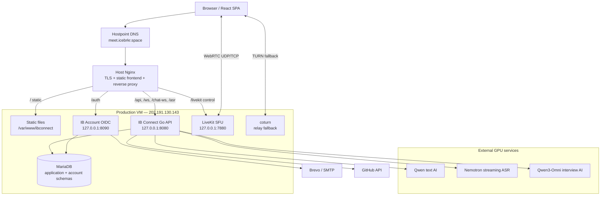
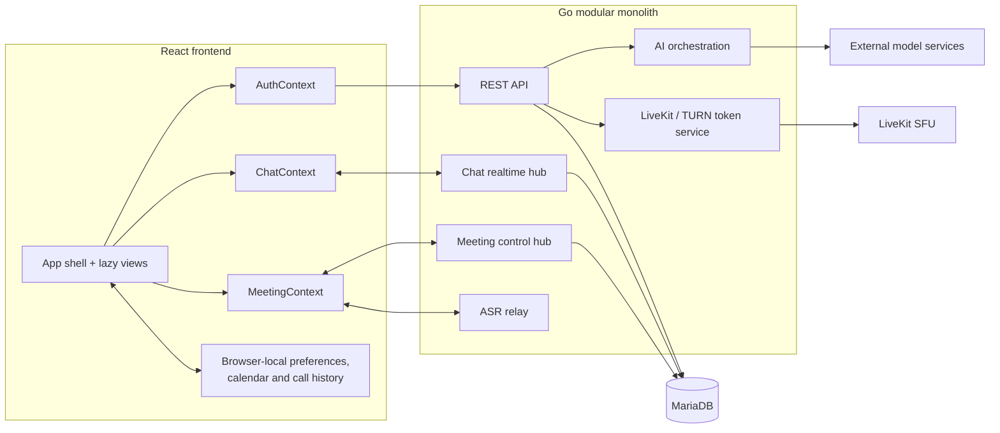
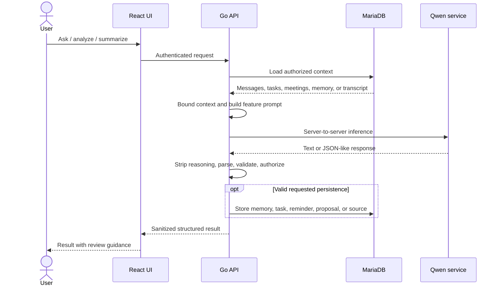
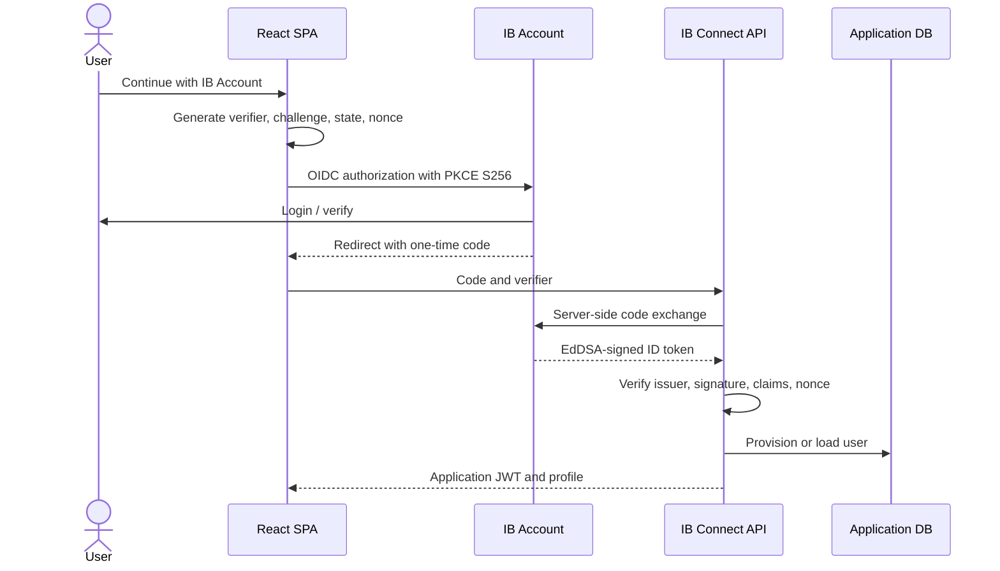
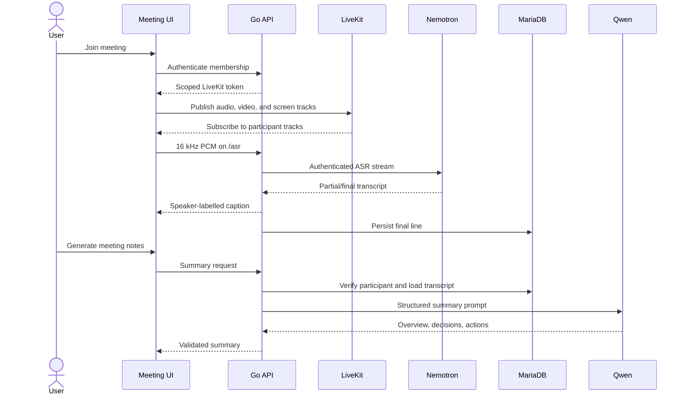
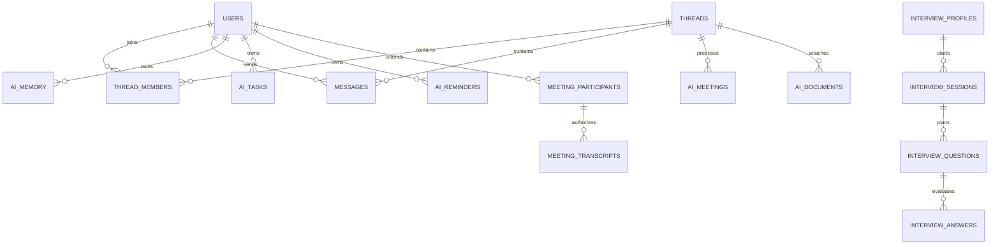

# IB Connect

IB Connect is a production communication and AI productivity application. It combines direct and group messaging, LiveKit audio/video meetings, live captions, meeting intelligence, scheduling, AI writing tools, personal AI memory/tasks/reminders, document Q&A, and AI-assisted virtual interviews behind one IB Account identity.

**Production:** [https://meet.icebrkr.space](https://meet.icebrkr.space)<br>
**Last code and deployment audit:** 10 September 2026<br>
**Feature inventory:** 119 requested capabilities: **38 complete**, **28 partial/in progress**, **52 not implemented**, and **1 infrastructure claim unverified**.

This README documents the system that exists today. Planned capabilities are labelled explicitly; they are not presented as working features.

## Contents

- [Feature status](#feature-status)
- [Architecture](#architecture)
- [Technology stack](#technology-stack)
- [AI models and architecture](#ai-models-and-architecture)
- [Application flows](#application-flows)
- [Data architecture](#data-architecture)
- [Repository structure](#repository-structure)
- [Docker Compose](#docker-compose)
- [Local development](#local-development)
- [Configuration](#configuration)
- [Production deployment](#production-deployment)
- [Security and privacy](#security-and-privacy)
- [Performance and scale](#performance-and-scale)
- [Testing](#testing)
- [Implementation roadmap](#implementation-roadmap)
- [Further documentation](#further-documentation)

## Feature status

For requirement-by-requirement evidence, including the relevant modules and remaining gap, see the [complete 119-capability feature status](docs/USER_FEATURE_STATUS.md).

### Completed

These are complete user flows in the current application.

#### Account and identity

- IB Account sign-in through OAuth 2.0/OIDC authorization code flow with PKCE, `state`, and `nonce`.
- Persistent IB Account sessions and automatic IB Connect session restoration.
- Email verification, forgotten-password flow, account management, and configurable Brevo or SMTP mail.
- Ed25519-signed identity tokens; IB Connect issues an HS256 application session after identity validation.

#### Messaging

- Private direct conversations and named group conversations.
- Durable MariaDB message history protected by thread membership checks.
- Real-time message delivery, presence, and typing events over `/chat-ws`.
- Per-user unread counts based on `last_read_at`.
- Text, image, file, and voice-message attachment flows.
- Keyword search across the signed-in user's conversations.
- Group member presence and activity scoped to thread members.

#### Audio and video meetings

- One-to-one and group audio/video calls through a LiveKit SFU.
- True audio-only calls as well as video calls.
- Pre-join camera, microphone, speaker, device, and connection checks.
- Microphone/camera controls and in-call device switching.
- Adaptive stream, dynacast, simulcast, visibility-aware subscriptions, and TURN fallback.
- Responsive participant grid, active-speaker ordering, paging, pin/spotlight, and minimized floating call view.
- Screen sharing, reactions, raised hands, waiting/admission controls, and participant list.
- Connection-quality badges, RTT/relay information, reconnection, and application room rejoin.
- Virtual backgrounds and blur through MediaPipe Selfie Segmentation.

#### Meeting intelligence

- English live speech-to-text captions with speaker attribution.
- Live transcript panel and durable transcript persistence.
- Transcript download from the Meetings/Debrief view.
- AI summaries with overview, key points, decisions, action items, owners, and follow-up.
- Active and post-call meeting notes UI with retry, copy, loading, and review guidance.
- Extended proxy/API deadlines that fix the previous meeting-summary 504 timeout.

#### AIPA

- Global Ask AIPA panel.
- Daily Focus grounded in the user's recent messages, tasks, reminders, meetings, profile, and browser calendar.
- Smart replies, tone-based rewriting, and translation.
- “Ask this conversation” Q&A and structured conversation analysis.
- Extraction of decisions, key points, open questions, tasks, reminders, and meeting suggestions.
- Persistent personal AI memory, tasks, reminders, and meeting proposals.
- Deterministic scheduling action after a narrow scheduling-intent gate; the model does not receive unrestricted tools.
- Meeting detection and meeting cards in chat.
- Local document extraction and per-document Q&A for PDF, DOCX, XLSX, PPTX, TXT, Markdown, CSV, and related text formats.
- Bounded per-account rate limiting for the general assistant endpoint.

#### Virtual interview

- Candidate profile, CV upload/parsing, and interview history.
- Local parsing for PDF, DOCX, TXT, Markdown, and RTF.
- Optional GitHub profile enrichment.
- AI-generated question plans.
- Browser capture of 16 kHz mono PCM WAV plus sampled JPEG frames.
- Multimodal answer evaluation and final report through a dedicated GPU service.
- Structured results stored in MariaDB; raw evaluation media is processed and discarded.

#### Delivery and UI

- Multi-stage production Docker images for the React frontend, Go API, and IB Account.
- Docker Compose topology with two MariaDB databases, Redis, LiveKit, health checks, volumes, and Nginx.
- Native production deployment at `meet.icebrkr.space` with TLS, systemd, MariaDB, LiveKit, and coturn.
- Same-origin REST, auth, WebSocket, caption, and LiveKit routing.
- Explicit CORS/WebSocket origins and baseline Nginx security headers.
- Lazy-loaded views and upgraded responsive dashboard, chat, calls, meetings, calendar, interview, security, and support UI.

### Partially implemented / in progress

These areas work today but do not yet satisfy the full product requirement.

| Area | Working today | Remaining gap |
|---|---|---|
| Privacy controls | Profile, notification, presence, device, and personalization settings | Unified privacy center, per-AI-feature controls, retention/export/delete, and consent policy |
| Data isolation | Thread and transcript authorization | Formal tenant/workspace isolation, hardened guest identity, connector ACLs, and retention controls |
| AIPA everywhere | Global assistant plus chat, meeting, document, dashboard, and interview AI | One context and action layer spanning every product |
| Proactive AI | Meeting detection, Daily Focus, tasks, reminders, and cards | Confidence ranking, preferences, cooldowns, relevance scoring, feedback, and interruption budgets |
| Personal knowledge | Thread Q&A, keyword search, memory, attachment Q&A | Cross-conversation semantic retrieval, vector index, reranking, and grounded citations |
| Read state | Per-member unread state | Per-message delivery/read receipts and group read-by lists |
| History | Up to 500 messages loaded | Cursor pagination and infinite history |
| Secure storage | TLS, authentication, authorization, MariaDB | Managed encryption at rest, key policy, object storage, malware scanning, and retention |
| Calendar | Browser-local calendar, schedule modal, shared cards | Server calendar, connectors, Free/Busy, attendee acceptance, and working hours |
| Scheduling | Detect/propose a discussed date and time | Slot comparison, voting, normalized time zones, editable agenda, and external calendar updates |
| AI tasks | Extraction, assignee matching, source IDs, free-text deadlines | Confirm-before-save, normalized deadlines, priority, deduplication, acceptance, and notifications |
| Documents | Extraction and per-attachment Q&A | OCR, object storage, scanning, chunking, library, cross-document RAG, and citations |
| Caption translation | Final English lines can use Qwen translation | Dedicated low-latency translation, batching, and predictable multilingual quality |
| Call scale | Multi-participant SFU on one node | Multi-node LiveKit, placement/draining, capacity tests, and regional resilience |
| Observability | Health endpoints, service/Nginx logs, browser diagnostics | Metrics, tracing, dashboards, SLOs, alerts, and AI cost/latency telemetry |

### Still needed

#### Critical product and privacy work

- Meeting recording, pause/resume/stop controls, visible indicator, storage, playback, and LiveKit Egress.
- Durable participant consent for recording, transcription, and analysis, including withdrawal and server-side enforcement.
- Per-feature AI privacy choices and a complete account data export/delete workflow.
- Per-message delivery/read receipts and group read-by lists.
- Searchable saved transcripts.
- Review and confirmation before AI tasks/reminders are saved.

#### Knowledge and integrations

- Embeddings, vector storage, hybrid search, reranking, and a unified ACL-aware RAG pipeline.
- Search across messages, transcripts, meetings, documents, tasks, and connected data.
- Citations that open the exact message, transcript time, or document span.
- Controlled web search with source routing, citations, privacy rules, budgets, and prompt-injection defenses.
- Google Drive with a scoped picker, ACL-aware ingestion, search, and AIPA Q&A.
- Google Calendar, Outlook Calendar, and Apple Calendar/CalDAV or ICS.
- Free/Busy, working hours, timezone-safe conflict detection, and participant acceptance.

#### Communication and workspace

- Server-managed workspaces, contacts, channels, roles, and enterprise multi-tenancy.
- Breakout rooms, richer host roles, participant permission policies, and meeting templates.
- A complete Tasks product with projects, states, due dates, recurrence, notifications, and audit trail.
- AIPA Drive with folders, sharing, versions, previews, lifecycle rules, and semantic search.
- Collaborative Docs, Sheets, Slides, Notes, Forms, and workflow automation.
- Safe cross-product orchestration with a reviewable plan, evidence, confirmation, idempotent execution, and audit log.

#### Platform engineering

- Versioned migrations; schema changes currently run at startup.
- Durable queues and workers for AI, files, notifications, reminders, and long reports.
- Object storage and CDN for attachments, avatars, recordings, and exports.
- Multi-instance realtime fan-out/presence; application realtime state is process-local.
- Comprehensive rate limiting, abuse protection, idempotency, circuit breakers, and dependency-aware retries.
- Automated CI/CD, staged releases, migration gates, canary/rollback, and load tests.
- Off-host backups, restore drills, RPO/RTO, and disaster recovery.
- Metrics, tracing, AI usage/cost metering, security audit logs, alerts, and SLOs.

## Architecture

### Current production topology

The live deployment is a single-host modular monolith with external GPU inference. Host Nginx terminates TLS and serves the React build. It routes API and control traffic to Go services and LiveKit. Media flows directly between browsers and LiveKit after the API issues scoped tokens.



The Compose deployment separates application and account data into two MariaDB containers and adds Redis for LiveKit state. Redis is **not currently an application cache or job queue**.

### Logical components



### Decisions to keep

- Keep the Go modular monolith while traffic and team ownership do not justify splitting ordinary CRUD.
- Keep LiveKit as the SFU; application servers should never relay meeting media.
- Keep GPU credentials and inference server-side.
- Keep MariaDB for transactional identity, messaging, permissions, tasks, and meetings after query/storage improvements.
- Keep authorization and side effects deterministic in Go. Models may propose; code validates identity, scope, inputs, and effects.
- Keep same-origin production routing for simpler cookie, CORS, socket, and deployment security.
- Keep deterministic local document/CV parsing where possible to reduce AI cost and latency.

## Technology stack

| Layer | Technology | Role |
|---|---|---|
| Web | React 19.0.1, React DOM 19.0.1, TypeScript 5.8 | Typed SPA |
| Build | Vite 6.2, React Vite plugin | Development, bundling, lazy chunks |
| UI | Tailwind CSS 4.1, Motion 12, Lucide React | Responsive styling, themes, transitions, icons |
| Routing | React Router DOM 7 | Client navigation support |
| Browser media | LiveKit Client 2.22 | WebRTC, screen sharing, reconnection |
| Effects | MediaPipe Selfie Segmentation | Blur and virtual backgrounds |
| Main API | Go 1.25, standard `net/http` | REST, auth callback, application logic, AI orchestration |
| Realtime | Gorilla WebSocket 1.5.3 | Chat, typing, presence, call signaling, ASR relay |
| Identity | Go 1.24 | IB Account OIDC provider |
| Tokens | `golang-jwt/jwt/v5` 5.3.1 | EdDSA identity and HS256 application JWTs |
| Passwords | PBKDF2-HMAC-SHA256, 600,000 iterations | IB Account password hashing |
| Data | MariaDB 10.11 native production; MariaDB 11.4 Compose | Application and identity persistence |
| SQL | `go-sql-driver/mysql` 1.8.1 | Go/MariaDB driver |
| PDFs | `ledongthuc/pdf` | Local PDF text extraction |
| Media server | LiveKit Server 1.9.7 in Compose | Audio/video/screenshare SFU |
| Realtime state | Redis 7.4 AOF in Compose | LiveKit coordination only |
| Relay | coturn | WebRTC relay fallback |
| Edge | Nginx 1.27 container; host Nginx production | TLS, static files, proxy, socket upgrades |
| Containers | Docker multi-stage builds, Compose | Reproducible environment |
| Runtime | Node 22 Alpine builder; Go Alpine builders; distroless non-root services | Small production images |
| Browser tests | Playwright 1.60, TSX scripts | Targeted UI/integration checks |

## AI models and architecture

IB Connect has three separate server-side inference paths. The application can run its core chat and call features without them; affected AI surfaces report degraded or unconfigured status.

| Capability | Current model/service | Transport | Behavior |
|---|---|---|---|
| AIPA text, rewriting, replies, analysis, translation, document Q&A, meeting detection/summaries | Service-reported `Qwen/Qwen3.5-2B-Base` | Go adapter to OpenAI-compatible `/v1/chat/completions` | Base reasoning model; API strips `<think>`, detects truncation/echoes, applies budgets/timeouts, and parses JSON defensively |
| Live English captions | `nvidia/nemotron-3.5-asr-streaming-0.6b` | Browser PCM → `/asr` → Go relay → GPU `/v1/stream` | One ASR socket per active speaker; 16 kHz mono PCM; final English lines are broadcast and persisted |
| Virtual interview | `cyankiwi/Qwen3-Omni-30B-A3B-Instruct-AWQ-4bit` | Go HTTP adapter to dedicated GPU endpoints | Question plans, WAV/JPEG answer evaluation, final report |

### AI safeguards and limitations

- Go assembles authorized context from the signed-in user's profile, recent messages, tasks, reminders, meetings, and calendar payload.
- Thread/document operations check membership before sending context to a model.
- AIPA gets no unrestricted application tools. Scheduling uses a narrow detector and deterministic Go execution.
- The text service has no enforced structured-output API. Prompts request JSON; Go extracts and validates a balanced object.
- Reasoning traces are removed before responses reach the browser.
- Feature-specific token budgets and deadlines bound model usage.
- Daily Focus validates every internal `source:kind:id` reference against supplied data.
- The current base model can be slow and less reliable than an instruction-tuned model with schema-constrained output.
- No embeddings, vector database, semantic index, unified RAG, web-search tool, web citations, general autonomous agent, or text-to-speech model exists.
- General image/OCR inference is not production-ready; the current `/query` service rejects `mm_token_type_ids`.
- NLLB is no longer deployed. Caption translation uses the separate Qwen text service and can lag.

The historical `gpu/asr_server.py` and `gpu/ASR_CONTRACT.md` describe Whisper language detection, IndicConformer, Nemotron, and NLLB. The **current deployed caption path is English Nemotron only**.

### AI request flow



## Application flows

### Authentication



### Messaging and calls

1. `AuthContext` restores identity and profile.
2. `ChatContext` loads authorized threads/messages and opens `/chat-ws`.
3. REST persists messages after membership checks.
4. The chat hub sends the persisted message to connected thread members.
5. Presence, typing, call invites/responses, and meeting reminders use the realtime channel.
6. Accepting a call passes audio/video preferences to `MeetingContext`, which joins the room and requests a scoped LiveKit token.

### Meetings, captions, and summaries



`/api/meetings/` has a 310-second Nginx timeout and the Go server has a 315-second write deadline because the current model may take minutes for a long summary. This fixes the prior 504; a durable asynchronous job is the scalable replacement.

### Documents

1. An authenticated thread member uploads a supported attachment.
2. Go extracts PDF text with `ledongthuc/pdf`, OOXML through ZIP/XML, and text formats directly.
3. Extracted text and document metadata are stored in MariaDB.
4. Document Q&A rechecks thread membership and sends at most 12,000 extracted characters to the text model.

Scanned PDFs have no OCR. Files are not chunked or embedded. Attachments are currently base64 in MariaDB and should move to object storage.

## Data architecture

### Main database

| Domain | Tables |
|---|---|
| Users | `users` |
| Messaging | `threads`, `thread_members`, `messages` |
| Scheduling | `scheduled_meetings` |
| AI workspace | `ai_memory`, `ai_tasks`, `ai_reminders`, `ai_meetings`, `ai_documents` |
| Meeting intelligence | `meeting_transcripts`, `meeting_participants` |
| Interviews | `interview_profiles`, `interview_sessions`, `interview_questions`, `interview_answers` |

IB Account has its own `users`, `otps`, `sessions`, `oauth_clients`, and `oauth_codes` tables.



Schemas are initialized with idempotent `CREATE TABLE IF NOT EXISTS` and `ALTER TABLE` statements at startup. Versioned migrations are still required. The main API uses up to 25 open and 5 idle DB connections; this is a conservative single-instance setting, not a capacity promise.

Personal calendar entries, call/meeting history, devices, theme, personalization, status, and notification preferences remain in `localStorage`. They are not synchronized or server-authoritative.

## Repository structure

```text
.
├── src/                         React frontend
│   ├── components/              Shell, views, dialogs, meeting UI
│   ├── context/                 Auth, chat, meeting providers
│   ├── hooks/                   Media, captions, layout, UI behavior
│   ├── lib/                     API, realtime, AI helpers, local stores
│   ├── App.tsx                  Main composition and lazy views
│   ├── config.ts               Runtime endpoints and Vite overrides
│   └── types.ts                 Frontend domain types
├── server/                      Go modular application API
│   ├── main.go                  Routes, core schema, chat, rooms, lifecycle
│   ├── ai*.go                  AIPA, brief, documents, meeting AI
│   ├── transcription_relay.go  Caption WebSocket relay
│   ├── meeting_transcripts.go  Transcript ACL, storage, summaries
│   ├── livekit.go              LiveKit and TURN grants
│   └── interview*.go           CV, GitHub, sessions, multimodal AI
├── ib-account/server/           Go OIDC identity provider
├── gpu/                         Model contracts, reference and mock servers
├── deploy/                      Docker, Nginx, LiveKit, systemd templates
├── docs/                        Master audit and feature status
├── tests/                       Targeted Playwright/TSX verification
├── Dockerfile                   Frontend image
├── compose.yaml                 Complete container topology
└── README.md                    This handbook
```

## Docker Compose

### Start

```bash
cp deploy/docker/env.example .env
# Replace every replace-with-* value. Generate independent secrets:
openssl rand -hex 32

docker compose --env-file .env up --build -d --wait
docker compose --env-file .env ps
```

Open [http://localhost:8088](http://localhost:8088).

| Service | Exposure | Purpose |
|---|---|---|
| `frontend` | `127.0.0.1:8088` | Nginx frontend and same-origin gateway |
| `backend` | Internal `8080` | REST, sockets, AI adapters, media tokens |
| `account` | Internal `8090` | OIDC provider |
| `app-db` | Internal `3306` | Application MariaDB |
| `account-db` | Internal `3306` | Identity MariaDB |
| `redis` | Internal `6379` | LiveKit state |
| `livekit` | TCP `7881`, UDP `50000–50100` | Direct media |

```bash
docker compose --env-file .env logs -f backend account livekit
docker compose --env-file .env down
```

`down` retains volumes. `down --volumes` permanently removes local database, identity key, and Redis data.

Compose does not obtain certificates or bind 443. For HTTPS, put a TLS proxy in front of loopback 8088 using [the host Nginx template](deploy/docker/host-nginx-compose.conf), set the public origin and secure cookies, and expose LiveKit media ports.

```dotenv
PUBLIC_ORIGIN=https://your-domain.example
IBCONNECT_ALLOWED_ORIGINS=https://your-domain.example
LIVEKIT_PUBLIC_URL=wss://your-domain.example/livekit
IB_ACCOUNT_INSECURE_COOKIES=0
```

For `PR_CONNECT_RESET_ERROR`, check DNS, inbound 80/443, Nginx/certificate, upstream 8088, then `docker compose ps`. That error occurs before React loads.

## Local development

Prerequisites: Node 22, Go 1.25, MariaDB, and optionally model mocks or external model services.

```bash
npm install
npm run dev       # Vite :3000
npm run server    # Go API
npm run dev:all   # both
npm run lint      # TypeScript no-emit check
npm run build
```

Vite proxies `/api`, `/ws`, `/chat-ws`, and `/asr` to the Go API. Same-origin production builds need no frontend environment variables because [`src/config.ts`](src/config.ts) derives URLs from the browser origin.

## Configuration

Templates:

- [Docker Compose environment](deploy/docker/env.example)
- [Native API environment](deploy/ibconnect.env.example)
- [Native IB Account environment](ib-account/deploy/ib-account.env.example)
- [Optional frontend overrides](.env.example)

### Required secrets

| Variable | Purpose |
|---|---|
| `IBCONNECT_JWT_SECRET` | Signs application sessions; at least 32 random characters |
| `APP_DB_PASSWORD` / `IBCONNECT_DB_PASSWORD` | Main DB credential |
| `ACCOUNT_DB_PASSWORD` / `IB_ACCOUNT_DB_PASSWORD` | Identity DB credential |
| `APP_DB_ROOT_PASSWORD`, `ACCOUNT_DB_ROOT_PASSWORD` | Compose DB initialization |
| `IB_ACCOUNT_CLIENT_ID`, `IB_ACCOUNT_CLIENT_SECRET` | Registered OAuth client |
| `LIVEKIT_API_KEY`, `LIVEKIT_API_SECRET` | LiveKit and token signing |
| `TURN_STATIC_AUTH_SECRET` | coturn HMAC credentials |

Optional integrations use `AI_GPU_*`, `ASR_GPU_*`, `INTERVIEW_GPU_*`, `GITHUB_TOKEN`, `EMAIL_API_*`, and `SMTP_*`. Deployment policy uses `PUBLIC_ORIGIN`, `IBCONNECT_ALLOWED_ORIGINS`, `IB_ACCOUNT_*`, `LIVEKIT_URL`, `TURN_HOST`, and `MAX_ROOM_SIZE`.

Never place a secret in `VITE_*`; Vite embeds those values into public JavaScript.

## Production deployment

The live site uses the established native deployment:

- Static frontend: `/var/www/ibconnect`.
- Host Nginx and TLS under `/etc/nginx`.
- `ibconnect-backend` systemd service on `127.0.0.1:8080`, environment `/etc/ibconnect/env`.
- `ib-account` systemd service on `127.0.0.1:8090`.
- Native MariaDB schemas, LiveKit, and coturn.

### Frontend

```bash
npm ci
npm run lint
npm run build
sudo rsync -a --delete dist/ /var/www/ibconnect/
sudo chown -R www-data:www-data /var/www/ibconnect
curl -s https://meet.icebrkr.space/ | grep -o 'assets/index-[^" ]*\.js'
```

### Backend

```bash
cd server
/usr/local/go/bin/go test ./...
/usr/local/go/bin/go build -o ibconnect-backend .
sudo systemctl restart ibconnect-backend
curl -fsS http://127.0.0.1:8080/health
```

A current API restart drops process-local rooms/realtime state and can interrupt active calls. Drain or schedule releases until that state is externalized.

Do not switch production to fresh Compose databases casually. Moving native data to containers requires backup, migration, validation, a maintenance/dual-run plan, and tested rollback.

## Security and privacy

### Present controls

- TLS and secure production identity cookies.
- OIDC code flow with PKCE S256, `state`, and `nonce`.
- Persistent Ed25519 identity signing key.
- PBKDF2-HMAC-SHA256 passwords: 600,000 iterations, 16-byte salt, 32-byte key.
- Explicit CORS and WebSocket origin allow-list.
- Thread membership and transcript participant/invitee authorization.
- Server-side model credentials and bounded context.
- Non-root distroless Go runtime images.
- Nginx CSP, frame, content-type, referrer, and browser-permission headers in the container gateway.
- Escaped dynamic account templates and no React `dangerouslySetInnerHTML`.

### Required hardening

- Replace 30-day app JWTs in `localStorage` with short access tokens and rotating HttpOnly refresh sessions; use one-time WebSocket tickets instead of query tokens.
- Harden client-provided guest meeting identity and admission.
- Add route-specific body/rate limits across account, telemetry, directory, messages, uploads, AI, tokens, and sockets.
- Require verified email and explicit audited identity linking.
- Make OTP attempts/consumption atomic, HMAC OTPs with a pepper, and revoke sessions after password changes.
- Quarantine uploads in object storage; inspect magic bytes, scan malware, cap ZIP expansion/parser time, and isolate prompt data.
- Add consent policy before recording or passive AI.
- Add workspace roles, tenant boundaries, audit events, key management, and retention/deletion.
- Treat retrieved text as untrusted data that can never grant tools or authorize actions.

India residency is operationally unverified by the repository. VM location alone does not prove where backups, logs, model requests, email, or future object data reside.

## Performance and scale

Current API deadlines are 10 seconds for headers, 30 seconds for reads, 315 seconds for writes, and 75 seconds idle. The main DB pool allows 25 open and 5 idle connections.

### Confirmed constraints

- Correlated/N+1 thread queries and fixed 500-message loading.
- Base64 attachments add roughly 33% before JSON/DB/socket overhead.
- Long AI work is synchronous; no durable queue, worker backpressure, or polling.
- Presence, fan-out coordination, rooms, and reminders depend on process-local state.
- Redis serves LiveKit only.
- Startup schema mutation blocks safe concurrent rollout.
- SQL keyword search is not semantic retrieval.
- One VM and one LiveKit node are correlated failure/capacity limits.
- The text model creates high tail latency, especially for structured output and caption translation.
- No complete metrics, tracing, SLO, capacity benchmark, automated backup verification, or DR drill.

| Scale | First pressure | Evolution |
|---|---|---|
| ~1,000 registered | Directory/threads, history, files, model latency, host incidents | Pagination, object storage, limits, AI quotas, monitoring, backups; keep monolith |
| ~10,000 | Process-local sockets/rooms, DB pools, one SFU | API replicas, Redis coordination, durable workers, HA DB, object storage/CDN, LiveKit cluster |
| ~100,000 | Global presence, SQL search, fan-out, AI noisy neighbors | Workspace-scoped realtime, partitioned events, hybrid search, tenant quotas, autoscaled AI, regional DR |
| Millions | Region/DB blast radius, residency, isolation | Tenant-partitioned regional cells and a small global control plane |

These are forecasts, not load-test results. Benchmark concurrent users, message rate, publishers, AI requests, and storage separately.

## Testing

```bash
npm run lint
npm run build

cd server
go test ./...
go vet ./...
go build ./...

cd ../ib-account/server
go test ./...
go vet ./...
go build ./...

cd ../..
docker compose --env-file .env config --quiet
docker compose --env-file .env up --build -d --wait
```

Production diagnostics:

```bash
sudo systemctl is-active nginx ibconnect-backend ib-account livekit
curl -fsS http://127.0.0.1:8080/health
curl -skI --resolve meet.icebrkr.space:443:127.0.0.1 https://meet.icebrkr.space/
sudo journalctl -u ibconnect-backend --since '10 minutes ago' --no-pager
```

There is no automated CI/CD or complete test pyramid. `tests/` contains targeted Playwright/TSX checks, and the Go AI layer has focused tests. Authorization, realtime reconnects, migrations, idempotency, AI parsing, and failure handling need broader automated coverage.

## Implementation roadmap

### P0 — before significant growth

1. Harden sessions, sockets, guest identity, identity linking, OTP/session revocation, limits, and uploads.
2. Add keyset pagination and efficient thread queries; move files to scanned object storage.
3. Add versioned migrations, transactions, idempotency, and measured indexes.
4. Add durable consent and per-feature privacy controls.
5. Add metrics, audits, alerts, backup automation, restore drills, and RPO/RTO.

### P1 — scale and reliability

1. Durable queue/workers for summaries, interviews, documents, reminders, notifications, and indexing.
2. External realtime coordination for safe API replicas.
3. Multi-node LiveKit with placement, draining, capacity limits, and synthetic media tests.
4. Confirmed-task review, normalized due dates, priority, dedupe, acceptance, and notifications.
5. Server calendar plus Google/Microsoft Free/Busy.
6. Instruction-tuned, schema-constrained models; routing, budgets, cache, quotas, telemetry, and evaluations.

### P2 — AI-native expansion

1. ACL-aware hybrid search and RAG across chat, transcripts, meetings, documents, tasks, and Drive.
2. Proactive ranking with confidence, urgency, relevance, preference, cooldown, interruption cost, and feedback.
3. Controlled web retrieval with citations, source policy, prompt isolation, and budgets.
4. Meeting recording, searchable playback, speaker-aware notes, decisions, tasks, and “What did I miss?”
5. AIPA Drive with permissions, previews, versions, lifecycle rules, and semantic indexing.

### P3 — connected workspace

1. Collaborative Docs, Sheets, Slides, Notes, Forms, Tasks, Calendar, and automations.
2. A cross-product planner that shows evidence and a reviewable plan, requests confirmation, executes idempotently, and audits every action.
3. Regional tenant cells, enterprise policy, customer-managed keys, legal hold, residency controls, and multi-region DR.

## Further documentation

- [Complete feature status](docs/USER_FEATURE_STATUS.md)
- [AIPA Technical + AI + Product Master Audit](docs/AIPA_MASTER_AUDIT.md)
- [IB Account](ib-account/README.md)
- [General Qwen contract](gpu/AI_CONTRACT.md)
- [ASR contract](gpu/ASR_CONTRACT.md)
- [Qwen3-Omni interview contract](gpu/CONTRACT.md)
- [Docker environment](deploy/docker/env.example)
- [Native backend environment](deploy/ibconnect.env.example)
- [LiveKit deployment](deploy/livekit/README.md)

No license file is present. Add an explicit license before external distribution or third-party contribution.
