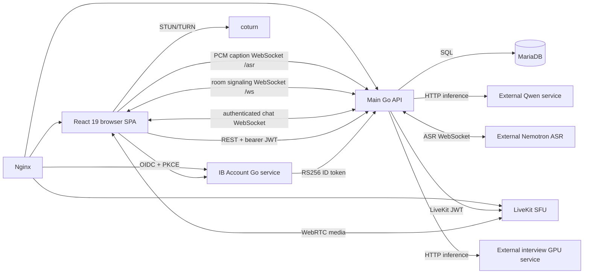
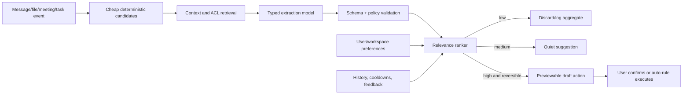
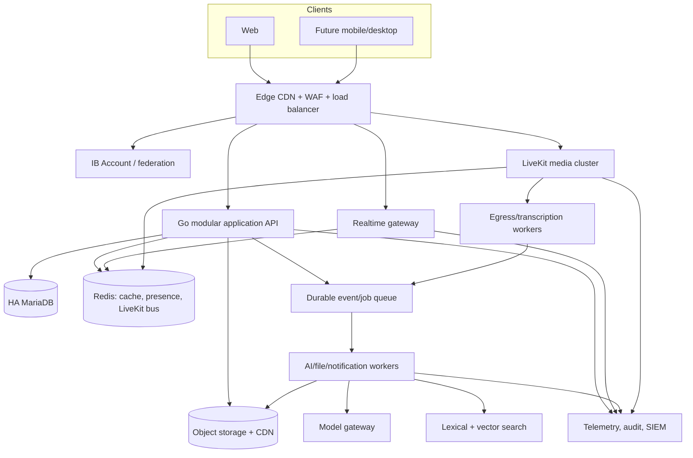

# AIPA end-to-end architecture, production, security, and product audit

**Audit date:** 7 September 2026  
**Repository:** `IB-Connect-ver-2`  
**Scope:** all checked-in application source, configuration, deployment templates, contracts, documentation, and tests. Generated dependencies, compiled binaries, images, model binaries, and WebAssembly were inventoried and assessed as artifacts but not interpreted line by line.

## Implementation status after the audit

The first remediation and product pass is included in this working tree. It adds a reproducible multi-container environment for the frontend, API, identity service, two isolated MariaDB schemas, Redis, and LiveKit; non-root production images; health checks; reverse-proxy security headers; HTTP deadlines and graceful API shutdown; a Docker-safe OIDC internal/public URL split; safer identity database startup; and Docker DNS re-resolution so Nginx survives backend container replacement. The stack was built and exercised through Nginx with all services healthy.

The same pass adds a server-grounded **Daily Focus** feature and a general **Ask AIPA** assistant, bounds and sanitizes assistant context, fixes JSON extraction around quoted braces, and adds focused Go tests. The dashboard, top bar, security center, support center, and sign-in copy were redesigned. Unsupported security/compliance statements were removed or explicitly marked as planned. Major views are lazy-loaded, unused Node dependencies were removed, and the online dependency audit is clean. These changes resolve several findings below; remaining items are intentionally retained so the document continues to describe the path from the audited baseline to the target architecture.

The follow-up security tranche adds a durable `meeting_participants` table populated by signaling admission and departure, enforces participant or scheduled-invitee access for transcript reads and summaries, caps and validates REST chat messages and attachments, applies a per-account rate limit to the general AI assistant, pins JWT verification to HS256, and replaces wildcard CORS/WebSocket origins with an explicit allowlist. The API now also has bounded read/write deadlines. These are immediate protections; Redis-backed quotas, one-time authenticated meeting join tickets, object storage, and durable workers remain the next scale tranche.

The latest product pass adds an AI Inbox to the dashboard, loading extracted tasks and reminders directly from the existing permissioned AI APIs with optimistic completion and dismissal. The Compose gateway now binds to loopback by default for TLS termination by host Nginx, and `deploy/docker/host-nginx-compose.conf` documents the public HTTPS proxy path. Public-domain DNS, firewall rules, certificates, and host Nginx are outside this repository and must be checked on the deployment host when browsers report connection resets.

The 10 September production pass fixes meeting-summary 504s by giving `/api/meetings/` the same long proxy window as AI analysis and aligning the Go server write deadline with the provider deadline. It also upgrades the active summary UI, adds transcript and AIPA notes access for past meetings, and carries audio/video call type through the invitation path so audio-only calls are audio-only for both participants. The detailed current feature matrix is in `docs/USER_FEATURE_STATUS.md`.

## Executive assessment

AIPA is a real, integrated product rather than a prototype. It already has persistent direct and group chat, presence, scheduled and instant calls, a LiveKit SFU media path, captions and transcript summaries, several LLM-assisted chat actions, document extraction, and a virtual-interview workflow. The code also contains thoughtful production work: OIDC authorization code flow with PKCE and nonce, bounded WebSocket send queues, ping/pong deadlines, slow-client eviction, LiveKit simulcast/dynacast/adaptive streaming, participant video subscription limits, reconnect grace periods, upload size limits in several AI paths, and explicit external service contracts.

The application still needs more hardening before substantial untrusted growth. The most urgent remaining issue is an authorization chain: `/ws` accepts an unauthenticated, client-chosen identity for guest entry; that identity becomes an in-memory room member; `/api/livekit/token` treats room membership as sufficient for a guest token. A caller who knows a room code may therefore impersonate a participant and obtain media publish/subscribe capability. The earlier transcript IDOR has been fixed: transcript and summary routes now require durable participant or scheduled-invitee access through `meeting_participants`.

The audit also found a gap between visible security claims and implemented controls. The earlier UI claimed end-to-end encryption, AES-256 database encryption, Swiss residency, BYOK KMS, immutable audit logs, Splunk/Datadog integration, MFA/FIDO2, enterprise SSO/RBAC, anomaly detection, and recording-consent controls. This working tree removes those unsupported statements and replaces them with evidence-backed descriptions of the controls actually present. Transport encryption to a LiveKit SFU must still never be described as end-to-end encryption.

The monolith itself is not the reason AIPA will fail at scale. A modular Go service can support the first meaningful growth phase. The immediate ceilings are unbounded or unpaginated data paths, a 25-connection database pool, base64 media in MariaDB and WebSocket payloads, N+1 thread queries, process-local room and reminder state, synchronous long-running GPU calls, missing quotas, and a single host shared by the API, database, SFU, TURN, and proxy. Fix those boundaries before extracting services.

## Evidence, confidence, and validation

This assessment is based on the current repository, not the intended architecture in planning documents. `CLAUDE.md`, `docs/DEFERRED.md`, contract files, and test results were used as operational evidence only where the live implementation is absent. The deployed Qwen service and the deployed Nemotron ASR service live outside this repository, so their internals, runtime hardening, model licenses, and measured capacity cannot be verified here. `gpu/asr_server.py` says it is a reference implementation and does not represent the current deployed ASR topology.

Validation performed during the audit:

| Check | Result | Meaning |
|---|---|---|
| `npm run lint` | Passed | Current TypeScript/ESLint rules pass. |
| Vite production build to `/tmp` | Passed | App compiles; lazy loading reduced the initial main JS from **1,330.86 kB / 368.32 kB gzip** to **1,147.06 kB / 326.57 kB gzip**. The remaining >500 kB chunk requires measured follow-up. |
| Normal `npm run build` | Failed before compilation | Existing `dist/assets` is owned by another user and Vite could not unlink it. The source is buildable, but the live-tree deployment process is fragile. |
| `go test ./...` in both Go services | Passed | Two focused AI parser/validation test files now run in the main service; broader unit and integration coverage is still absent. |
| `go vet ./...` in both Go services | Passed | No issues detected by standard vet checks. |
| Python `py_compile` for checked-in GPU scripts | Passed | Syntax only; it does not validate model behavior or GPU compatibility. |
| `npm audit` | Zero advisories after dependency cleanup and lockfile updates | This was run online; production scanning should still run continuously in CI. |

A tracked test artifact, `tests/_signup.json`, contains an expired JWT. It is no longer usable, but auth artifacts should never be committed; remove it from history, ignore generated session files, and rotate/revoke any still-valid credentials discovered with a secret scanner.

## System architecture as implemented

The browser has three distinct realtime paths: chat events through `/chat-ws`, meeting membership/control through `/ws`, and media directly through LiveKit. Captions add a fourth path through `/asr`. This split is workable, but it creates multiple independent notions of room membership. Today those notions are not bound to one authenticated authorization record.

### Repository and module map

| Area | Files | Actual responsibility and findings |
|---|---|---|
| App composition | `src/App.tsx`, `src/main.tsx`, `src/config.ts`, `src/types.ts` | State-driven SPA shell, OIDC callback, view selection, meeting deep link. Major product views are now lazy-loaded. `/:roomCode` still effectively catches arbitrary paths. HTTP clients now use `config.apiBase`. |
| Authentication client | `src/components/auth/LoginPage.tsx`, `src/context/AuthContext.tsx`, `src/lib/pkce.ts` | Correct PKCE/state/nonce generation and callback storage; the resulting 30-day app JWT and cached user live in `localStorage`, exposing them to any XSS. Cached identity is rendered before server validation. |
| Chat client | `src/context/ChatContext.tsx`, `src/components/views/ChatsView.tsx`, `src/components/chat/UserProfileModal.tsx`, `src/lib/api.ts` | REST history plus one authenticated WebSocket, typing, presence, files, voice notes, AI actions. Message fetch has no cursor in the UI. Failed sends can disappear from the composer. A static `ChatProvider._loadMessages` bridge and dynamic import of an already statically imported module are brittle and prevent useful splitting. |
| Meeting client | `src/context/MeetingContext.tsx`, `src/components/meeting/*`, `src/hooks/useWebRTC.ts`, `src/lib/signalingSocket.ts` | LiveKit room lifecycle, prejoin, calls, layouts, screen share, device changes, waiting room, reactions, captions, reconnect, minimized calls. `ActiveMeetingView.tsx` and `useWebRTC.ts` are oversized control centers and should be decomposed without replacing LiveKit. |
| Meeting performance helpers | `src/hooks/useGridLayout.ts`, `useTileOrder.ts`, `useHasVideo.ts`, `useStalledVideoRecovery.ts`, `useSilentMic.ts`, `src/lib/gridLayout.ts`, `tileOrder.ts`, `stallDetector.ts`, `connectionStats.ts`, `connectionTest.ts`, `diagnostics.ts` | Useful client adaptation and diagnostics. Subscription limits and active-speaker promotion are concrete strengths. Client diagnostics can submit unauthenticated arbitrary log fields to the server. |
| Captions | `src/hooks/useLiveCaptions.ts`, `src/lib/captions.ts`, `src/lib/liveCaptions.ts`, `CaptionBar.tsx` | Opens a second microphone capture and sends PCM through deprecated `ScriptProcessor`; it does not reuse the LiveKit local audio track. This duplicates capture, CPU, upstream bandwidth, and permission complexity. |
| Background effects | `src/hooks/useBackgroundEffect.ts`, `public/mediapipe/*` | Hook and ~12 MB of local models/WASM exist but the hook has no caller. The hook loads MediaPipe scripts from jsDelivr instead of the checked-in assets, adding privacy, availability, and supply-chain exposure. |
| Product views | `DashboardView.tsx`, `CalendarView.tsx`, `CallsView.tsx`, `DebriefView.tsx`, `InterviewView.tsx`, `SecurityView.tsx`, `SupportView.tsx` | Dashboard and product surfaces. Calendar, call history, preferences, and personalization are primarily per-browser `localStorage`. Security and support surfaces now describe current behavior and clearly distinguish planned controls. The dashboard includes a server-grounded Daily Focus view. |
| Main API | `server/main.go` | HTTP routing, JWT, OIDC exchange, users, profiles, threads/messages, schedules, chat WS, room signaling WS, TURN credentials, schema bootstrapping. It is a broad monolith with useful cohesion but weak boundary middleware and several missing method/body limits. |
| AI core | `server/ai.go`, `server/ai_gpu.go`, `server/ai_brief.go` | Qwen chat, rewrite, replies, thread Q&A/analysis, Daily Focus, memory/tasks/reminders, keyword search, translation, prompt cleanup/retry. The general assistant uses a fixed server prompt and bounded history; Daily Focus uses authorized records and validates source references. No embeddings, vector retrieval, RAG, streaming, tool runtime, quota, or durable AI job queue. |
| Proactive meetings | `server/ai_meetings.go`, `src/lib/intelligence.ts`, `src/lib/aiMeetingCard.ts`, `src/lib/aiDateParse.ts` | Frontend regex insights plus backend regex-gated LLM meeting extraction and a per-process reminder ticker. It is narrow, duplicate-prone, timezone-unaware, and not an orchestration platform. |
| Documents | `server/ai_documents.go` | PDF/DOCX/XLSX/PPTX extraction and LLM Q&A. Whole-file synchronous extraction, only the first 12,000 characters reach the LLM, no OCR/chunk retrieval, and inadequate archive/malware controls. |
| Captions and transcripts | `server/asr_gpu.go`, `server/transcription_relay.go`, `server/meeting_transcripts.go` | Browser PCM relay to external English ASR, Qwen translation, transcript persistence, summaries. Contains an ASR disconnect deadlock and transcript authorization defects. |
| LiveKit adapter | `server/livekit.go` | Hand-built, short-lived LiveKit grants. The compact implementation is reasonable, but guest authorization inherits spoofable `/ws` membership. |
| Interview | `server/interview.go`, `interview_cv.go`, `interview_github.go`, `interview_gpu.go` | CV parsing/enrichment, question planning, multimodal answer scoring, reports. Media is deliberately not persisted, which avoids putting large interview recordings in MariaDB. |
| Identity service | `ib-account/server/*.go`, `ib-account/server/web/*` | Separate OIDC issuer, email verification/reset, sessions, password hashing, JWKS, account UI. Stronger HTTP lifecycle than the main API, but weak rate limiting, reset revocation, OTP concurrency, key rotation, and operational email handling. |
| GPU contracts | `gpu/*.md`, `gpu/mock_*`, `gpu/asr_server.py` | Valuable API contracts and mocks. They explicitly document that the production model services are separate. Qwen vision is documented as broken and bearer enforcement as absent on the external AI service. |
| Deployment | `deploy/**`, `ib-account/deploy/**`, `.env.example` | Nginx references, LiveKit and systemd templates, env templates. Manual single-host deployment, no reproducible complete production config, no IaC, no CI/CD, and inconsistent ownership instructions. |
| Verification | `tests/*.mjs`, `tests/*.ts`, `tests/loadtest/**` | Large ad hoc Playwright/browser regression library and mesh/SFU load harness. Useful historical coverage, but no unified runner, isolation, CI, fixtures, API/DB load suite, or repeatable pass/fail gate. Several tests can mint app JWTs. |
| Documentation | `README.md`, `CLAUDE.md`, `docs/**`, service READMEs | Detailed operational history and contracts are a strength. Several READMEs describe old states and conflict with current code or checked-in results, so they are unsafe as current runbooks. |

## End-to-end flows

### Sign-in

1. `LoginPage.tsx` creates state, verifier, challenge, and nonce and redirects to IB Account.
2. `ib-account/server/oidc.go` authenticates an HttpOnly session, creates a one-use authorization code, and later validates PKCE.
3. `src/App.tsx` sends the code/verifier/nonce to `server/main.go:handleOIDCCallback`.
4. The main API fetches the token and JWKS, validates the RS256 ID token, provisions or finds a local `users` row, and returns its own HS256 app JWT.
5. `AuthContext.tsx` stores that JWT in `localStorage`; REST uses it as bearer auth and chat WS appends it to the URL.

Latency and failure points: the main API uses default `http.PostForm`/`http.Get` clients with no timeout or response cap; a slow identity service or JWKS endpoint can hold connections indefinitely. A username collision can fail provisioning. Existing email rows are not checked for a conflicting previously bound `ib_sub`, and email verification is not required before provisioning. JWTs in query strings can reach proxy logs.

### Chat message

1. `ChatsView.tsx` calls `ChatContext.sendMessage`.
2. `src/lib/api.ts` POSTs JSON, including a base64 Data URL for an attachment or voice note, to `/api/threads/{id}/messages`.
3. `server/main.go:handleMessages` checks thread membership, inserts `messages`, reloads the message, and broadcasts it to every connected member.
4. The chat WS reader/writer loop sends it to clients; `ChatContext` adds it to an in-memory `Map`; React renders the conversation.
5. The server may launch regex-gated meeting detection in a detached goroutine.

The membership check is sound. The costly part is moving the entire base64 object through JSON, MariaDB `LONGTEXT`, API history responses, and every WebSocket. There is no server file-size/type validation in this route, object storage, CDN, cursor pagination, idempotency key, or robust failed-send state. History returns the oldest 500 messages, making newer messages unreachable once a thread exceeds 500.

### Thread list

`GET /api/threads` first selects a user's threads using correlated last-message subqueries, then calls `loadThread` for every row. `loadThread` performs more correlated subqueries plus member queries. This is an N+1 path whose latency and DB connection use grow with every conversation. It also has no pagination. Replace it with one set-based query or two bounded queries, a `thread_user_state` table holding last-read and optionally last-message metadata, and keyset pagination. Add the associated compound indexes after examining `EXPLAIN` on production-shaped data.

### Meeting join and media

1. A client opens `/ws`, sends `create_room` or `join_room`, and supplies its own identity/name.
2. `server/main.go` updates an in-process room map and optionally runs waiting-room messages.
3. The browser calls `/api/livekit/token`. Signed-in users get their bearer subject as identity; guests are accepted if the client-chosen signaling identity appears in the room map.
4. `useWebRTC.ts` joins LiveKit and publishes audio/video/screen tracks. LiveKit provides the SFU media path, adaptive stream, dynacast, and simulcast.
5. A separate signaling socket carries transient chat, reactions, hand state, approvals, and some membership state.

The architectural weakness is step 1: no signed capability binds a guest to an invitation or waiting-room approval. Any member can also toggle waiting rooms or approve/deny users because no durable host role exists. In-process state disappears on restart and cannot be shared by multiple API instances.

### Live caption to summary

1. `useLiveCaptions.ts` captures a second mic stream, converts it to PCM, and writes `/asr` frames.
2. `transcription_relay.go` validates only the spoofable in-memory room membership, proxies frames to external ASR, and broadcasts partial/final results.
3. Final lines are synchronously inserted into `meeting_transcripts` before broadcast.
4. Translation starts one detached goroutine per final caption and calls Qwen sequentially by language behind a semaphore of two.
5. Any authenticated user can request `/api/meetings/{room}/transcript` or `/summary`; the handler does not check that user's participation.

DB latency blocks final-caption delivery despite a comment claiming persistence never blocks. If the GPU read side dies while the browser remains connected and silent, `pumpASRSession` waits for the GPU writer, which waits for another audio frame or cancellation; the session can deadlock instead of reconnecting. Summary generation sends the full transcript synchronously and has no result cache or job state.

### AI thread analysis and proactive meeting extraction

Manual analysis loads up to 60 recent messages, concatenates them into a prompt, calls Qwen, extracts an object with a brace counter, and inserts decisions/tasks/reminders. Repeating the action creates duplicates because there is no source-based unique key or upsert. Memory is append-only and limited mostly to thread decisions. Search is recent keyword `LIKE` over up to eight terms rather than semantic retrieval.

Automatic meeting detection first runs regexes, then creates a goroutine, waits on a three-slot process semaphore, loads 30 human messages, and asks Qwen for meeting JSON. A message arriving while a thread is in flight can be skipped indefinitely. Multiple API instances can create duplicates. Date interpretation uses server time instead of the user's timezone. Chat content is untrusted prompt content but is not delimited or treated as data, so indirect prompt injection can manipulate extraction.

### Virtual interview

The browser uploads a base64 CV; the API extracts text locally, parses fields, optionally fetches a fixed-host GitHub profile, persists a profile, and calls the external interview GPU for questions/evaluation/reporting. The separation of media and stored results is good. Answers can be submitted more than once for a question and completed reports can be regenerated at additional cost because database uniqueness and atomic status transitions are absent.

### API surface and boundary ownership

| Surface | Routes/protocol | Authorization and architectural notes |
|---|---|---|
| Identity | `/auth/oauth/authorize`, `/token`, `/jwks.json`, discovery | IB Account session for authorization; confidential client and PKCE at exchange; RS256 ID token. Scope handling is nominal and there is no UserInfo endpoint. |
| Account | `/auth/api/register`, `verify`, `resend`, `login`, `logout`, `session`, `forgot`, `reset`, `account`, `password` | Secure cookie session for account operations. Per-account lockout exists, but no robust IP/device abuse boundary. |
| App authentication/profile | `/api/auth/oidc/callback`, `/api/auth/me` | OIDC exchange produces a separate HS256 bearer. Profile update shares the `/me` handler and needs strict method/schema limits. |
| Directory/chat | `/api/users`, `/api/threads`, `/api/threads/{id}/messages`, `/chat-ws` | Bearer/member checks on thread/message data. Directory is global. Chat WS authenticates via URL query JWT. |
| Meeting scheduling | `/api/meetings/scheduled`, `/schedule`, `/validate/{code}` | Bearer required, but JSON invitees and weak short codes prevent a durable authorization model. |
| Meeting control/media | `/ws`, `/api/livekit/token`, `/api/turn-credentials` | Signaling and TURN are unauthenticated; LiveKit signed-user path is stronger but guest path trusts signaling membership. |
| Caption/meeting intelligence | `/asr`, `/api/meetings/{room}/transcript`, `/summary` | ASR checks process-local membership; transcript endpoints check only login, not meeting access. |
| Chat AI | `/api/ai/status`, `chat`, `rewrite`, `reply-suggestions`, `ask-thread`, `analyze-thread`, `memory`, `tasks`, `reminders`, `search`, `translate` | Most routes require bearer/member access where a thread is involved. Generic chat lets clients set `system`; no common quota/rate policy. |
| Document AI | `/api/ai/documents/extract`, `/ask` | Bearer plus message/thread ownership checks are present; parsing and inference are synchronous. |
| Interview | `/api/interview/*` | Bearer and per-user profile/session checks are mostly present; GPU calls are synchronous and write idempotency is absent. |
| Diagnostics/health | `/api/client-events`, `/health`; account `/healthz` | Client events are public; health endpoints are shallow liveness checks rather than readiness. |

Handlers are registered directly in `server/main.go:2177-2267` and use local method switches rather than a shared router/middleware stack. This keeps dependencies small, but it produces inconsistent method enforcement, body limits, error shapes, authorization, logging, and rate policy. Introduce small standard middleware and typed request helpers inside the monolith; a framework rewrite is unnecessary.

### Configuration, secrets, and third-party integrations

Runtime secrets are environment-driven and templates correctly leave primary secret fields blank. The backend fails fast for its JWT and database password, and identity fails fast for its DB password. Extend that approach to TURN production auth, OIDC client credentials, LiveKit, and configured model workload credentials. Store real values in a secret manager or protected system credential facility, rotate with overlapping key IDs where protocols allow it, and never source secrets through frontend `VITE_*` variables.

Actual external dependencies are MariaDB, IB Account/OIDC, LiveKit, coturn, GitHub's public API for CV enrichment, transactional email via Brevo/Resend/SMTP, the Qwen HTTP service, Nemotron ASR WebSocket, and the interview GPU HTTP service. MediaPipe is present for background segmentation but unused. The unused `@google/genai`, Express, dotenv, and Express type packages have been removed, shrinking the installed dependency set materially. The root package is now `ib-connect-web`; the main Go module remains `ibconnect-signaling` and should be renamed only with coordinated build and observability changes.

`VITE_API_BASE` is now used by `src/lib/api.ts`, and empty Docker build arguments fall back to same-origin paths. Continue toward one validated runtime/build configuration for every HTTP and WebSocket client. Validate absolute URLs and allowlisted schemes/hosts so configuration cannot become a token-exfiltration path.

## Critical security and privacy findings

| Priority | Current implementation | Problem and scale/security impact | Required solution | Files |
|---|---|---|---|---|
| **P0** | `/ws` has `CheckOrigin: true`, no authentication, and trusts `user_id`; guest LiveKit token issuance checks that in-memory identity. | Identity spoofing can grant unauthorized media publish/subscribe access and meeting control. A spoofed identity can also evict the real connection. | Introduce a server-created `meeting_participants`/`meeting_invites` record and a short-lived, signed, single-room join capability. Authenticate the WS handshake with a one-time ticket, derive identity/name server-side, enforce roles, and issue LiveKit grants from the durable authorization record. Restrict origins. | `server/main.go:72-78,1849-1960`; `server/livekit.go:121-148`; `src/context/MeetingContext.tsx` |
| **Completed** | Transcript GET and summary POST previously required only any app bearer token. | Authenticated IDOR exposed private meeting speech and permitted unauthorized GPU spend. | `meeting_participants` is now populated from signaling admission; transcript and summary handlers require recorded participation or scheduled creator/invitee access. Retention/export policy and legacy ownership backfill remain. | `server/meeting_transcripts.go`; `server/main.go` |
| **Completed** | UI/support content asserted controls absent from code. | Users and customers could make decisions based on false encryption, residency, compliance, SSO, MFA, monitoring, and audit guarantees. | The unsupported claims are removed in this pass and planned controls are labeled. Preserve this evidence-only rule in content review and automated UI checks. | `src/data.ts`; `SecurityView.tsx`; `SupportView.tsx`; account HTML |
| **P0 / Partially completed** | Chat attachments/voice notes remain base64 JSON in `LONGTEXT`, but the message path now has an 8 MiB body cap, text/name/type/size checks, and rejects empty messages. | Direct API clients can still consume database/storage capacity within the cap, and file contents are not scanned. | Move blobs to object storage with magic-byte validation, malware scanning, quotas, and immutable object IDs. Store metadata only in MariaDB. | `server/main.go`; `src/components/views/ChatsView.tsx`; `src/lib/api.ts` |
| **P0 / Partially completed** | External Qwen contract says bearer enforcement is disabled. The generic `/api/ai/chat` now uses a fixed server prompt, bounded text/history, and a process-local 20 requests/minute/account guard. | Network reachability or many API replicas can still permit uncontrolled GPU use. | Network-isolate model endpoints, require mTLS or workload credentials, move quotas to Redis/workspace policy, impose global concurrency, and meter token/latency/error usage. | `gpu/AI_CONTRACT.md:49-60`; `server/ai.go`; `server/ai_gpu.go` |
| **P1** | App JWT is valid for 30 days in `localStorage`; chat WS puts it in the query string. | XSS or log exposure becomes long-lived account takeover. | Use a secure HttpOnly app session or short access token plus rotating HttpOnly refresh token. Mint 30–60 second one-time WS tickets and redact query strings. Add CSP. | `server/main.go`; `src/context/AuthContext.tsx:26-44`; `src/lib/api.ts:241-246` |
| **P1** | Any authenticated user can enumerate every user including email/profile, without pagination. | Privacy leakage and an O(N) payload become severe as the user base grows. | Return minimal directory fields, require search/prefix, scope by workspace/contact policy, paginate, and hide email by default. | `server/main.go:702-719`; `AuthContext.tsx` |
| **P1** | Existing local email rows are bound with `COALESCE(ib_sub, ?)` without rejecting a different bound subject; `email_verified` is not required. | Identity linking can become inconsistent and unsafe during issuer/account changes. | Require verified email, make issuer+subject the canonical external identity, and perform explicit, audited account linking. Reject mismatched existing bindings. | `server/main.go:558-607` |
| **P1 / Partially completed** | OIDC/JWKS calls use a bounded client; the main server has read/header/write/idle limits plus graceful shutdown. Response-body caps and dependency-aware readiness remain incomplete. | Very large dependency responses or a nominally live but disconnected instance can still fail poorly. | Cap identity response bodies, add startup/readiness dependency checks, and expose latency/error metrics. | `server/main.go` |
| **P1** | Identity OTP and throttling updates are non-atomic; OTPs are plain SHA-256; password reset/change does not revoke sessions. | Concurrent guesses bypass attempt limits, DB compromise permits cheap OTP brute force, and stolen sessions survive password recovery. | Transactional OTP consume with `SELECT FOR UPDATE` or atomic conditional update; HMAC OTPs with a server pepper; revoke user sessions/auth epoch after reset and offer session management. | `ib-account/server/store.go`; `handlers.go:309,371` |
| **P1** | Identity rate limiting is mainly per-account lockout; unknown users avoid PBKDF2 cost; forgot/resend can generate mail. | Credential stuffing, username timing enumeration, email abuse, CPU exhaustion, and lockout denial of service. | Layer token buckets by IP/account/device/workspace, dummy hash for unknown users, risk-based throttles, bounded mail queue, CAPTCHA only under abuse. | `ib-account/server/handlers.go`; `store.go`; `email.go` |
| **P1** | Uploaded documents trust extensions and directly enter prompts; ZIP parsing lacks aggregate expansion limits. | Malware, archive bombs, and indirect prompt injection can consume resources or manipulate AI outputs. | Quarantine object upload; detect content by magic; AV/CDR where appropriate; cap entries, aggregate uncompressed bytes, ratios and parse time; delimit untrusted text; prohibit document content from granting tool permission. | `server/ai_documents.go`; `interview_cv.go` |
| **P1 / Partially completed** | CORS and WebSocket origins now use `IBCONNECT_ALLOWED_ORIGINS`; unauthenticated `/api/client-events` still accepts arbitrary log fields. | Cross-site abuse is reduced, but logs can still be flooded or polluted. | Authenticate or tightly rate-limit telemetry; schema-allowlist fields, sanitize control characters, sample and cap per IP/session. | `server/main.go`; `src/lib/diagnostics.ts` |

Additional findings:

- `handleMe` accepts a query token and auto-provisions any missing row for a valid app JWT. Remove the query-token path and separate authenticated lookup from provisioning.
- Static TURN credentials fall back to `webrtc/webrtc123` when HMAC is not configured. Production startup should fail if TURN shared-secret auth is unavailable; reduce the current 12-hour credential lifetime and rate-limit issuance.
- Scheduling uses a `SCHED-` code with only four hex characters and no collision retry. It also stores date/time as strings and invitees as JSON, preventing reliable timezone handling and indexed membership queries.
- The main JWT parser should explicitly allow only HS256. Pin issuer/audience as the system evolves and support key rotation.
- Runtime identity DB setup creates a database with a privileged account. Provision schemas through migrations with a separate deploy credential; run services with least-privilege users.
- Identity mail is launched in an unbounded goroutine and logs complete verification/reset email bodies in log mode, including secrets. Use a bounded durable queue and never log codes.
- The OAuth token endpoint consumes a code before fully validating redirect URI, client, and PKCE. Validate and consume atomically so an invalid exchange cannot burn a legitimate code.
- No React path uses `dangerouslySetInnerHTML`. The account HTML uses templates and escapes dynamic values, which is a present strength, but both web apps still need an enforced CSP and normal dependency scanning.

## Database and API scalability

### Schema and query problems

The main schema is created at startup through independent `CREATE`/`ALTER` statements in `server/main.go`, `ai*.go`, transcript, and interview modules. There is no migration ledger, checksum, ordering lock, rollback, or compatibility policy. Concurrent releases can race. Adopt versioned migrations run once by the release job; keep application startup read-only with respect to schema.

MariaDB remains appropriate for accounts, chat metadata, threads, calendars, tasks, and permissions through at least the 100,000-user range if data access is fixed and the database is separated from media/AI compute. Immediate data work:

1. Replace thread N+1 queries with a set-based projection and keyset pagination. Verify with `EXPLAIN ANALYZE` using production-shaped cardinalities.
2. Change message pagination to `WHERE thread_id=? AND (created_at,id)<(?,?) ORDER BY created_at DESC,id DESC LIMIT ?`, returning a cursor. Add/confirm `(thread_id, created_at, id)`.
3. Normalize scheduled invitees into `meeting_invite(meeting_id,user_id,status,...)` with `(user_id,start_at)` and store `start_at` as UTC timestamp plus IANA timezone.
4. Add indexes for AI owner/status/due paths: tasks `(created_by,status,created_at)`, reminders `(user_id,status,remind_at)`, memory `(user_id,thread_id,created_at)`, AI meetings `(thread_id,status,starts_at)`, and account expiry/lookup paths. Exact index order should follow real query plans.
5. Add uniqueness for active AI extraction provenance and interview answers `(session_id,question_id)`. Add foreign keys to all owner/source relationships where lifecycle semantics are clear.
6. Move avatars, chat files, voice messages, interview uploads, recordings, exports, and document originals out of MariaDB. Use object metadata, content hash, scan state, size, tenant, owner, retention, and ACL columns.
7. Add database pool telemetry and configure connection lifetime/idle settings. A fixed max of 25 main connections and 10 account connections is safe only as an intentional starting point; multiplying it by replicas can overwhelm MariaDB.
8. Use transactions and checked errors for thread creation/member inserts and atomic claims for reminder/job delivery. Several current write paths ignore `Begin`, `Exec`, `Commit`, or scan failures.

### Scale envelope

User count alone does not determine capacity; concurrent active users, messages per second, simultaneous media publishers, AI requests, and stored bytes do. No current benchmark establishes these dimensions. The following is a failure-order forecast from code paths, not a capacity promise.

| Growth level | What is likely to break first | Architecture response |
|---|---|---|
| **~1,000 registered users / tens to low hundreds concurrent** | User-directory payload, N+1 thread loading, oldest-500 message bug, base64 files, GPU queueing/latency, unauth telemetry/AI abuse, single-host incidents. | Complete P0/P1 controls, paginate, object storage, per-route limits, query fixes, service metrics, off-host backups, synthetic checks. The modular monolith is sufficient. |
| **~10,000 users / hundreds to low thousands concurrent** | Process-local WS/room state blocks replicas; global presence broadcasts become O(N); reminder tickers duplicate; 25 DB connections and correlated queries saturate; one host creates correlated outages; one SFU lacks redundancy. | Load-balanced API replicas; Redis for ephemeral presence/fanout and LiveKit distributed mode; durable queue for AI/notifications; DB on dedicated HA nodes; object storage/CDN; isolate GPU workers and LiveKit. |
| **~100,000 users / thousands to tens of thousands concurrent** | Global directory/presence model becomes untenable; write/read contention, search `LIKE`, notification fanout, AI cost and noisy neighbors, single-region latency, one-room SFU node limits. | Workspace/contact-scoped presence; partitioned fanout subjects; read replicas where measured; OpenSearch or database FTS for lexical search plus vector retrieval; autoscaled worker pools; per-tenant quotas; multiple LiveKit nodes with Redis and draining; tested regional DR. |
| **Millions** | A single logical database and regional realtime plane become organizational and blast-radius constraints; data residency and tenant isolation dominate. | Cell architecture: tenant/workspace assigned to a regional cell containing API/realtime/database/cache/workers, with a small global identity/directory/control plane. Shard by tenant, not arbitrary rows; multi-region object storage policy; isolated enterprise keys and audit. |

Do not split ordinary CRUD into microservices now. Extract only boundaries with different scaling or failure characteristics: media/SFU, asynchronous AI workers, file processing, notification delivery, and search indexing. Keep a modular application API until team ownership or measured load justifies further separation.

## Performance and cost priorities

| Rank | Change | Impact | Effort | Evidence |
|---|---|---:|---:|---|
| 1 | Cursor-paginate messages and threads; rewrite thread list queries | Very high | Medium | `server/main.go:829-984` performs N+1/correlated work and strands messages after 500. |
| 2 | Object storage + signed upload/download + thumbnails | Very high | Medium-high | Base64 inflates bytes by ~33% before JSON/DB/WS overhead and repeats payloads across history and fanout. |
| 3 | Route-level body limits, deadlines, cancellation, rate/cost quotas | Very high | Medium | Several public/AI/message routes are unbounded or synchronous for up to minutes. |
| 4 | Queue AI analysis, documents, summaries, interview reports, reminders | High | Medium | HTTP requests and per-process goroutines currently hold long GPU work and duplicate across replicas. |
| 5 | Reuse the LiveKit audio track for captions; replace `ScriptProcessor` with AudioWorklet | High | Medium | Current caption path opens a second mic and raw PCM uplink. |
| 6 | Cache document extraction/summaries by content hash and meeting summaries by transcript revision | High | Low-medium | Repeated calls recompute and repay model cost. |
| 7 | Continue frontend chunking and remove the unused background effect | Medium | Low-medium | View-level lazy loading and dependency cleanup are complete, reducing initial transfer by about 11%. Meeting/LiveKit code still keeps the initial chunk above 1 MB and the background effect remains unused. |
| 8 | Virtualize message/member lists and expose stable context APIs | Medium | Medium | Chats renders all loaded messages; mutable Map/static-provider bridge creates fragile updates. |
| 9 | Batch caption translation and use a fit-for-purpose low-latency translation model | Medium-high | Medium | One Qwen reasoning call per final caption per language can take seconds to minutes. |
| 10 | Add bounded GitHub/AI caches and request coalescing | Medium | Low | Interview GitHub cache is process-local and unbounded for unique handles. |

Frontend network calls should accept `AbortSignal`, have operation-specific deadlines, and distinguish retryable reads from non-idempotent writes. Message sends need a client-generated ID, optimistic `pending/sent/failed` state, server uniqueness, and explicit retry so a transient error does not silently discard typed content. Avoid automatic retries for mutations unless idempotency is present.

## AI architecture audit

### Current capability

The AI layer is a direct orchestration adapter around external models:

- Qwen provides generic chat, rewrite, suggested replies, thread Q&A, structured thread analysis, meeting extraction, translation, document Q&A, and meeting summary.
- External English Nemotron ASR provides live captions through a Go WebSocket relay.
- A separate interview GPU contract provides question planning, transcription, multimodal evaluation, and final reporting.
- Persisted AI data consists of append-only memory/decisions, tasks, reminders, extracted document text, detected meetings, and transcript lines.
- Retrieval is fixed recent-message windows or leading-wildcard SQL search. There are no embeddings, vector indexes, chunk retrieval, reranking, citations to source spans, cross-conversation memory, agent tools, or model gateway.

Prompts generally concatenate system instructions, user inputs, conversation text, or document contents. Parsing is best-effort JSON extraction. The brace counter does not account for braces inside strings. Model output is accepted with light shape checking, then written to product tables. This is enough for demos and controlled use, but not for reliable autonomous action.

The primary hallucination points are missing conversation history outside fixed windows, ambiguous assignee substring matching, date resolution with server timezone, truncated documents, uncited search answers, and treating model JSON as factual. The primary cost points are unrestricted generic chat/system prompts, repeated analysis inserts, no result cache, Qwen used for low-complexity translation, and long synchronous reasoning output (`<think>` cleanup indicates the serving model is not configured for these latency-sensitive tasks).

### Required AI control plane

Add an internal model gateway before expanding AI features. It should own model selection, prompt/version registry, token and latency accounting, per-tenant budgets, concurrency, deadlines, retries with jitter, circuit breakers, redaction policy, cache keys, structured-output validation, and provider/model fallback. Store an AI run record with tenant, user, feature, prompt version, model, input source IDs, token counts, latency, outcome, and feedback—without indiscriminately storing sensitive prompt bodies.

Use a durable job system for work that can exceed a normal request deadline. A job record and queue message should contain IDs and permissions, not whole private documents. Workers re-check authorization, fetch source data, write versioned results, and emit completion events. The UI shows queued/running/failed states and can cancel. Keep rewrite and smart replies synchronous with strict subsecond/few-second budgets; make document ingestion, long summaries, meeting intelligence, and interview reports asynchronous.

### Retrieval, memory, and trust

Use a hybrid retrieval design:

1. Normalize source objects—message, transcript segment, document chunk, task, event—with tenant/workspace ACL, author, timestamps, retention class, and immutable source reference.
2. Extract text asynchronously, chunk semantically, and create embeddings only for eligible content. Maintain an embedding model/version so re-indexing is controlled.
3. Retrieve by ACL-filtered lexical + vector search, rerank a small candidate set, and return citations to exact sources. Never fetch globally and filter permissions after generation.
4. Separate episodic source history from explicit personal memory. Suggested memory should include provenance, confidence, sensitivity, expiry, and user controls to accept/edit/delete. Do not infer or retain sensitive traits by default.
5. Treat retrieved messages/files as untrusted data. Clearly delimit them, instruct the model that embedded instructions have no authority, sanitize tool inputs, and keep tool permissions outside the prompt.

Vector search should be added when semantic search/RAG ships, not preemptively. For the first 100,000 users, MariaDB plus a dedicated search engine or a PostgreSQL migration only if strategically justified can work; since MariaDB is already operational, a separate OpenSearch-style lexical index plus a vector service is less disruptive than rewriting all transactional storage. Benchmark managed and self-hosted options using recall, filter correctness, latency, and operating cost.

### Proactive trigger and ranking system

Replace detached regex-triggered actions with an event-driven suggestion pipeline:

A candidate score should combine extraction confidence, imminence, specificity, user impact, relationship/context relevance, novelty, prior acceptance for that action type, and a nuisance penalty. Apply hard gates for permissions, sensitive domains, ambiguous people/times, and irreversible/external actions. Suggested starting policy:

- Below 0.55: retain no user-visible suggestion.
- 0.55–0.75: place in a noninterruptive insights tray.
- 0.75–0.90: show one inline suggestion if no cooldown applies.
- Above 0.90: prepare a reversible draft; auto-execute only when the user has created an explicit rule for that exact action class.

Use per-thread and per-action cooldowns, a daily suggestion budget, “less like this,” dismiss, undo, and reason/source display. Learn thresholds from acceptance/dismissal while keeping deterministic safety gates. Financial, employment, medical, legal, broad-sharing, payment, deletion, and external-send actions always require confirmation. Every tool invocation re-authorizes the current user and tenant at execution time; a prompt can propose a tool call but cannot grant it.

### AI feature roadmap

**Must have**

- Cited conversation search and “ask this conversation” using ACL-filtered hybrid retrieval.
- Catch-up summaries with new-since-last-read boundaries, decisions, open questions, and source links.
- Deduplicated action-item extraction with assignee confirmation, dates/timezones, status, provenance, and sync to one server-side Tasks model.
- Smart replies, rewrite, tone, grammar, and translation through a low-latency model gateway with budgets.
- Meeting captions, consent, versioned notes, decisions/action items, “what did I miss?”, and editable/exportable outputs.
- Document ingestion with safe parsing, OCR, chunking, citations, and cached extraction.
- Explicit personal memory controls, retention, provenance, and workspace boundaries.

**High value**

- Multimodal image/screenshot understanding after the broken vision contract is replaced and evaluated.
- Cross-conversation and file search with people/project/entity filters.
- Voice assistant using streaming ASR, interruptible responses, and visible action previews.
- Calendar, task, contact, email, and drive connectors through scoped OAuth and a permission-aware tool layer.
- Meeting agenda preparation from related threads/files/tasks and post-meeting follow-up drafts.
- AI-generated Docs/Sheets/Slides based on governed templates and cited workspace sources.
- Team knowledge pages that update from accepted decisions, with owners and freshness warnings.

**Experimental/future**

- Multi-step agents with time/budget/tool limits, sandboxed execution, checkpoints, and approval policies.
- Personal workflow learning and recurring automations created explicitly by users.
- Cross-meeting decision graphs, organizational expertise discovery, and project risk prediction with strong privacy controls.
- Real-time meeting coach, semantic interruption detection, and optional multimodal nonverbal feedback only after consent and bias evaluation.

## Video and audio calling audit

The move from peer mesh to LiveKit SFU is the right foundation. The browser publishes one upstream track set, while the SFU selects/forwards layers; the code enables adaptive stream, dynacast, simulcast, screen-share layers, visible-tile subscription limits, active-speaker promotion, reconnection, and stalled-track recovery. Those are meaningful quality and scale features already present.

Current feature comparison:

| Capability | AIPA now | Production direction |
|---|---|---|
| Multiparty media | LiveKit SFU, no configured room cap | Keep SFU; establish tested participant/publisher caps per node and product tier. |
| Network adaptation | Simulcast, adaptiveStream, dynacast, viewport/subscription controls | Keep; expose network recovery states and collect anonymized QoE metrics for join time, freeze, RTT, loss, jitter, bitrate. |
| Screen sharing | Distinct detail track and layout support | Keep; add presenter permissions, tab/system-audio UX, and mobile capability handling. |
| Reconnection | WS grace, session restore, LiveKit reconnect/stall recovery | Keep and chaos-test API/SFU/TURN/network transitions. |
| Audio quality | Browser/LiveKit processing plus silent-mic help | Verify constraints per browser/device; add device test, audio-level diagnostics, and server-side optional denoise only where needed. |
| Layouts | Responsive grid, pagination, speaker mode, floating/minimized call | Keep; virtualize participant UI and test accessibility/keyboard/mobile at higher counts. |
| Chat/reactions/hand | Transient signaling data | Persist meeting chat and events if product requires history; apply moderation and role ACLs. |
| Waiting room | Optional, any member can control | Add organizer/co-host/presenter/attendee roles, default policies, admit/deny audit, lock/remove/mute controls. |
| Recording | Absent | Add opt-in LiveKit Egress only after consent indicators, retention, object storage, ACLs, and regional policy exist. |
| Captions/transcript | English ASR relay; Qwen translation; partial persistence | Fix auth/deadlock, reuse audio track, add consent/retention, diarization and language strategy, then notes/Q&A. |
| Background blur | Unused MediaPipe hook; CDN-loaded code | Wire and benchmark the existing hook or remove assets until ready; self-host approved runtime/model resources. |
| Breakouts, polls, Q&A, host controls | Absent or partial | Build from concrete customer need after roles and durable room state, rather than cloning a checklist. |
| Meeting links/calendar | Short schedule codes and local/server split | Create durable meeting objects, stable links, invite ACLs, recurrence/timezones, calendar sync, and lifecycle state. |
| E2EE | Not enabled | LiveKit supports application-enabled media/data E2EE, but AIPA must implement key distribution and acknowledge that server-side recording/transcription conflicts with strict E2EE. Offer clear room modes and policies. |

Google Meet and Zoom currently expose mature host safety controls, recording/transcription, breakouts, and richer scheduled-meeting administration; AIPA should prioritize the security/control plane and reliable core before feature parity. AIPA's differentiator should be permission-aware meeting intelligence connected to conversations, tasks, and files.

### Video scaling architecture

Do not build a custom SFU. At modest load, move the current single LiveKit node to a dedicated media VM and keep TURN isolated or independently scalable. At redundancy/10,000-user demand, deploy at least two LiveKit nodes with Redis, a load balancer that supports the required WebSocket/media topology, and connection draining; one room generally needs to fit on one node, so large-room capacity must be benchmarked separately. Add region-aware deployment only when user geography and measured latency justify it.

Recording and transcription are separate worker workloads. Deploy LiveKit Egress with autoscaled CPU capacity, write recordings to object storage, and emit lifecycle webhooks into the durable event bus. For captions, use LiveKit participant/track identity as the authoritative source and fan the server-side audio track to streaming ASR where possible. This avoids a second browser capture. Diarization should bind recognized speech to authenticated track identity, with confidence and user correction.

AI meeting outputs need a `meeting_artifact` model: transcript revisions, summary versions, decisions, tasks, source time ranges, author/model, consent state, visibility ACL, retention, and edits. “What did I miss?” retrieves only segments after a participant's join/last-presence timestamp. Ask-meeting responses cite timestamped segments. Follow-up generation produces drafts and never sends messages or assigns people without configured policy/confirmation.

Official reference points: LiveKit documents Redis as required for distributed multi-node mode and supports connection draining and region-aware routing; it also provides optional E2EE that requires application-managed key distribution and Egress for recording. Google Meet documents host safety controls, reactions, hand raising and breakouts, while Ask Gemini in Meet uses meeting and permissioned Workspace context and warns that generated answers can be wrong. Zoom documents host-managed breakouts and transcript controls. See [LiveKit distributed deployment](https://docs.livekit.io/transport/self-hosting/distributed/), [LiveKit encryption](https://docs.livekit.io/transport/encryption/), [LiveKit Egress](https://docs.livekit.io/home/egress/web/), [Google Meet features](https://support.google.com/meet/answer/13396001), [Ask Gemini in Meet](https://support.google.com/meet/answer/16024610), and [Zoom transcripts](https://support.zoom.com/hc/en/article?id=zm_kb&sysparm_article=KB0085682).

## Reliability and operations

The main service now has structured shutdown plus header and idle timeouts, but `/health` does not test dependencies; startup sets every user offline, which becomes wrong as soon as there are multiple replicas. Room maps, presence sockets, AI in-flight gates, GitHub cache, and reminder tickers live in one process. Restart loses state; replicas disagree; multiple tickers can send duplicate reminders. Final transcript persistence blocks caption broadcast. Long model calls have transport retries but no durable job deadline, circuit breaker, global queue visibility, or graceful provider fallback.

Adopt these reliability patterns incrementally:

- **API:** readiness separate from liveness; strict input limits; operation deadlines; panic recovery; structured error codes and request IDs; graceful drain; idempotency keys for message/action/meeting mutations.
- **Database:** transactions for multi-row writes; unique constraints as concurrency guards; deadlock retry only for safe/idempotent units; migration lock; slow-query log and pool saturation metrics.
- **Events/jobs:** transactional outbox so a DB state change and its event cannot diverge; workers claim jobs atomically; retry with exponential backoff/jitter; dead-letter state and manual replay; dedupe by event/action key.
- **Realtime:** Redis-backed presence/fanout, connection ownership TTL, scoped channels, resume sequence numbers, and snapshot recovery after missed events. Do not broadcast the full global user list/status.
- **External AI/identity/GitHub:** bounded queues, bulkheads by feature/tenant, circuit breakers, fallback UI, cached safe results, and clear retry semantics.
- **Files:** multipart/signed direct upload, checksum, scan/quarantine state, resumable transfer, lifecycle/retention, CDN, and orphan cleanup.
- **Backups/DR:** encrypted off-host backups, binlog point-in-time recovery, object versioning, key backups, quarterly automated restore tests, documented RPO/RTO, and a regional failover exercise. Repository notes mention nightly backups and a restore check, but no automation is checked in and the same-disk risk remains documented.

Observability is currently plain journald logging plus spoofable client events. Add OpenTelemetry traces across API/job/model calls; RED metrics per route; DB pool/query metrics; WebSocket connections/queue drops; LiveKit QoE and node load; ASR/LLM queue time, first-token/final latency, tokens and cost; object scan failures; auth/abuse signals; and product success metrics. Define SLOs for login, message send/receive, call join, call media quality, caption delay, and AI completion. Alert on user-visible symptoms and budget burn, not raw CPU alone.

The present deployment is a manually updated working tree on one machine, with MariaDB, Nginx, coturn, API, identity, and LiveKit sharing failure and resource domains. The checked-in Nginx file is explicitly a pre-cache reference; the complete active configuration is absent. `deploy/livekit/README.md` says config should be root-owned although the service runs as `ubuntu`, an install-time permission contradiction. Build artifact ownership already broke a normal local production build during this audit.

Create a reproducible pipeline: protected main branch; lint/typecheck/unit/integration/security scans; immutable versioned artifact or container; signed provenance/SBOM; staging smoke and migration compatibility; release to a new directory/image; health check; atomic traffic switch; rollback; and post-deploy synthetic login/chat/call checks. Run database migrations as a controlled release step. Use dedicated Unix identities, systemd hardening/resource limits for every service, secret manager injection, and separate media/GPU/data nodes before adding orchestration complexity.

## Testing strategy

The many Playwright scripts capture valuable regressions, especially meeting recovery and layout behavior, but they are individual scripts with production coupling. Some generate JWTs using the app signing secret, which means the test environment can mint arbitrary identities. Convert them into a test project with isolated identities/database, deterministic cleanup, tagged browser/device suites, captured traces on failure, and CI gates. Keep destructive production smoke tests read-only and use separately scoped synthetic accounts.

Required test layers:

1. Go handler/service tests for authorization matrices, input limits, pagination, idempotency, transactional races, and provider failure behavior.
2. MariaDB integration tests for real constraints/query plans, including concurrent OTP consume, duplicate DM/message/action/interview answer, and reminder claim.
3. Contract tests against GPU mocks plus scheduled staging tests against each deployed model version.
4. Browser tests for OIDC, chat offline/retry, meeting roles/waiting room, guest tickets, reconnect, caption consent, and transcript ACL.
5. Load tests for REST/DB/chat WS fanout, many rooms versus one large room, TURN-relayed users, AI queues, object upload, and long-call QoE. Do not run software-encoded browser clients on the SFU host when measuring SFU capacity.
6. Security tests for IDOR, cross-tenant search, WS identity/origin, upload bombs, prompt injection/tool authorization, token replay/revocation, and rate limits.

The tracked LiveKit results show the expected upstream advantage over mesh. They do not establish production capacity: at 6–8 simulated clients, the shared host reached ~100% largely because software browser clients ran on that same host. The load-test README also says tests were not run despite committed result files. Treat the suite as a harness, repeat it on isolated generators, and publish scenario, hardware, build, and acceptance thresholds.

## Product architecture: from messenger to AI-native workspace

The product currently has duplicate local and server concepts: browser calendar versus scheduled meetings, local call history versus transcripts, UI intelligence versus server extraction, and personal settings versus account data. A productivity ecosystem needs canonical server-side domain objects before more screens:

- Workspace/tenant, membership, role, group, channel, conversation, message.
- Person/contact and external identity.
- Meeting, occurrence, invitation, participant role, attendance, artifact.
- Task/project, assignee, watcher, source, status, due time.
- File/folder/version/share/ACL and document logical object.
- Calendar/event/availability and integration account.
- Notification, delivery channel, preference, digest, receipt.
- AI suggestion, source/provenance, score, state, feedback, execution.
- Automation rule, tool grant, run, approval, step, budget, audit record.

Every object carries `tenant_id`, an immutable ID, ACL/visibility, creator, timestamps, version, retention class, and audit fields. Authorization is evaluated in the data access layer and search index, not entrusted to UI hiding or model instructions.

### Cross-product orchestration example

For “Let's meet next Tuesday and discuss the project budget”:

1. A message-created event triggers a cheap plan/deadline candidate detector.
2. A typed extractor returns participants, topic, relative time, project candidates, confidence, and source span.
3. The policy/ranker checks user preference, cooldown, workspace policy, and ambiguity. “Next Tuesday” is resolved in the sender's timezone and shown explicitly.
4. A nonintrusive card proposes “Find a time.” No calendar data is accessed until existing connector grants permit it.
5. The availability tool fetches free/busy only for authorized participants and returns options. AIPA shows what calendars were checked.
6. On confirmation, one idempotent workflow transaction creates the meeting/event/invites and room policy, links the source message/project, and emits events.
7. Background retrieval finds permissioned budget files and recent decisions. AIPA drafts an agenda with citations; the organizer chooses what to share.
8. Notifications follow participant preferences and timezone quiet hours.
9. At meeting start, consent policy controls captions/recording. Attendance and artifacts are bound to participant ACLs.
10. Afterward, AIPA drafts summary, decisions, task assignments, document updates, and follow-up. Each source is timestamped. Assignees accept or the organizer confirms before tasks become active or external messages are sent.

This requires a workflow engine with durable state, retries, idempotency, compensation, pause-for-approval steps, and per-step authorization. It does not require a free-form autonomous agent with broad credentials. Begin with typed workflows—schedule meeting, prepare agenda, close meeting, summarize project—and add model planning only inside constrained schemas.

### Product differentiation

AIPA can differentiate through continuity rather than another isolated AI chat box:

- A project brief that stays linked to the conversations, meetings, decisions, tasks, files, and people that produced it.
- “Catch me up” scoped to what changed since a user's last read across a project, with citations and an action queue.
- Decision memory that distinguishes proposals, accepted decisions, superseded decisions, owners, and evidence.
- Meeting intelligence that prepares from existing work and writes accepted outcomes back into tasks/docs/calendar.
- Permission-aware relationship context: suggest the right person or file because the graph shows relevant collaboration, while never exposing inaccessible content.
- A personal attention manager that ranks commitments and unresolved threads under explicit user controls and quiet periods.
- Governed automations that users can inspect, simulate, approve, undo, and audit.

Avoid building Docs, Sheets, Slides, and Drive simultaneously. First build the shared file/ACL/version/search platform and integrations with existing suites. Add native collaborative documents only when the connected workflow creates enough product value to justify CRDT collaboration, import/export fidelity, accessibility, offline sync, and a large compatibility burden.

## Prioritized roadmap

### P0 — critical before significant exposure or growth

| Recommendation | Problem/current state | Proposed solution and benefit | Complexity / risk / dependencies | Files/modules |
|---|---|---|---|---|
| Secure meeting identity and roles | Unauthenticated signaling creates trusted membership and media grants. | Durable meeting ACL, signed one-time join tickets, server-derived identity, organizer/co-host roles, origin allowlist. Closes media/control takeover. | **M–H**; migration must preserve guest UX. Depends on meeting schema and token versioning. | `server/main.go`, `livekit.go`, `MeetingContext.tsx`, `signalingSocket.ts` |
| Protect transcripts | Any user can read/summarize a known room. | Participant ACL on transcript, summary, export, search; retention and access audit. | **M**; legacy ownership backfill is the risk. Depends on durable participants. | `meeting_transcripts.go`, meeting UI |
| **Completed: correct security claims** | Product advertised nonexistent guarantees. | Unsupported statements were removed and planned controls are labeled; keep evidence-backed content review as a release gate. | **L** completed; maintain with automated content checks. | `data.ts`, `SecurityView.tsx`, `SupportView.tsx`, account HTML |
| Bound and externalize chat files | Server accepts oversized Data URLs into DB and realtime fanout. | Immediate body caps, then object storage, scan pipeline, signed URLs and quotas. | **M–H**; migration/retention and content delivery risk. Depends on storage provider. | message API/UI/schema/Nginx |
| Lock down AI spend and trust boundary | Generic assistant prompts are now server-owned and bounded, but quotas are absent and external model auth is reportedly off. | Gateway policy, workload auth/network isolation, per-user/tenant budgets and global concurrency. | **M**; fallback behavior needed. | `ai.go`, `ai_gpu.go`, GPU deployment contract |
| Remove generated auth artifact | Expired JWT is tracked. | Delete artifact/history as policy requires, add ignore pattern and secret scan. | **L**; history rewrite only if sensitive live material is found. | `tests/_signup.json`, `.gitignore`, CI |

### P1 — high impact foundation

| Recommendation | Problem/current state | Proposed solution and benefit | Complexity / risk / dependencies | Files/modules |
|---|---|---|---|---|
| Harden HTTP/session/auth | Long localStorage JWT and WS query token remain. Explicit HS256 validation, origin allowlists, route body caps for messages, HTTP/JWKS timeouts, and graceful shutdown are complete. | HttpOnly/rotating sessions, WS tickets, dependency readiness, and remaining route-specific limits. | **M–H**; coordinate frontend and proxy. | auth client, `server/main.go`, Nginx |
| Fix identity lifecycle | OTP races, limited abuse defense, sessions survive reset, mail leaks codes in logs. | Atomic/HMAC OTP, layered throttling, dummy hash, revoke sessions, bounded durable mail, key rotation. | **M**; email deliverability and migration. | `ib-account/server/*` |
| Fix relational access paths | N+1 threads, bad pagination, JSON invitees, missing indexes/constraints. | Set-based queries, keyset cursors, normalized invitations, UTC timestamps, measured indexes, transactions. | **M**; online migration/backfill. | `main.go`, all schema initializers |
| Durable event/job layer | Detached goroutines and per-process tickers lose/duplicate work. | Transactional outbox + queue; idempotent workers for AI, reminders, files, notifications. | **H**; operate queue and define schemas. Depends on metrics and IDs. | AI/meetings/documents/interview/new worker package |
| Realtime horizontal scale | Room/presence state lives in one process; status broadcasts globally. | Redis presence/fanout, scoped subscriptions, resume sequences; LiveKit Redis cluster separately. | **H**; race/reconnect testing. Depends on durable meeting ACL. | `main.go`, chat/meeting contexts, LiveKit config |
| File platform | DB blobs and synchronous parsing cannot scale. | Object store/CDN, metadata/ACL, scan/quarantine, extraction jobs, previews, lifecycle. | **H**; privacy/retention design. | chat/docs/interview/new storage module |
| AI gateway and evaluation | Direct Qwen calls have variable 15–200s latency, weak parsing, no version/cost trace. | Typed structured outputs, model routing, streaming where useful, budgets, fallback, eval datasets and run telemetry. | **H**; model benchmark required. | `ai_gpu.go`, AI handlers/contracts |
| Caption reliability and privacy | Second mic, deadlock, synchronous DB write, unbounded translation waiters. | Reuse published track, AudioWorklet/server track egress, cancel both pump directions, async ordered transcript persistence, bounded translation queue, consent. | **M–H**; cross-browser/media testing. | caption hook, relay, transcripts |
| Observability/SLO/DR | No metrics/traces/alerts; backup automation absent; one shared host. | OTel, dashboards/SLOs, off-host PITR, restore automation, dependency isolation and capacity tests. | **M–H**; operational ownership. | all services/deploy |
| Reproducible CI/CD | Manual live-tree releases and stale runbooks; no automated tests. | Immutable artifacts, staged migrations, test gates, atomic rollout/rollback, synthetic smoke. | **M**; requires test isolation. | deployment, package scripts, CI, docs |
| Frontend performance/reliability | View lazy loading cut initial transfer, but the main chunk remains about 1.15 MB; the context bridge, request cancellation, and failed-send state remain weak. | Split meeting/media code from the signed-in shell, use a stable context API, virtualize lists, add request deadlines and optimistic idempotent sends. | **M**, low product risk. | `App.tsx`, views, contexts, `api.ts` |

### P2 — product expansion after the foundation

| Recommendation | Problem/current state | Proposed solution and benefit | Complexity / risk / dependencies | Files/modules |
|---|---|---|---|---|
| Canonical tasks/calendar/meetings | LocalStorage and server models conflict. | Multi-tenant domain models, timezones, recurrence, ACLs, notification preferences, offline sync. | **H**; data migration. Depends on authz/events. | calendar/calls/AI meetings/new domain modules |
| Hybrid search and grounded RAG | `LIKE` search and fixed windows miss context and citations. | ACL-first ingestion, lexical/vector retrieval, reranking, source citations and retention deletion. | **H**; privacy and index consistency. Depends on file/event platform. | AI/search/new index workers |
| Proactive suggestions | Regex/detached LLM only detects some meetings. | Candidate/extract/validate/rank pipeline, confidence tiers, cooldowns, daily budgets, feedback and undo. | **H**; nuisance/privacy evaluation. Depends on canonical objects and events. | intelligence/AI/new suggestion service |
| AI-native meeting lifecycle | Captions and summaries are disconnected outputs. | Agendas, consent, diarized transcript, catch-up, cited Q&A, editable decisions/tasks/follow-up drafts. | **H**; ASR quality and ACL. Depends on meeting artifacts/RAG. | meeting/caption/AI/task/file modules |
| Workspace integrations | No real calendar/email/drive/contact tools. | Scoped OAuth connectors, encrypted token vault, sync cursors/webhooks, permission-aware typed tools. | **H**; provider policy and support burden. Depends on tool authorization/audit. | new integrations/tool layer |
| Notification service | Reminders reach only open sockets. | Durable preferences, inbox, push/email/mobile delivery, quiet hours, digest, retries/receipts. | **M–H**. Depends on jobs/events. | reminders/chat WS/new notification worker |
| Enterprise tenancy | Global user space and no workspace RBAC. | Tenant membership, roles/policies, SCIM later, tenant-aware unique keys/queries/cache/search/audit. | **H**, high migration risk. Begin before enterprise data growth. | every persistent/realtime domain |

### P3 — longer-term bets

| Recommendation | Proposed direction | Dependencies and risks |
|---|---|---|
| AIPA Drive | Files/folders/versioning/shares/previews/semantic search built on the P1 file and ACL platform. | Storage cost, sync client, malware/retention, migration/import. |
| AIPA Docs/Notes | CRDT-based collaborative content with comments, offline sync, AI drafting and source links. | Only after identity, ACL, event, file/version, and search layers. Accessibility and format fidelity are major scope. |
| Sheets/Slides/Forms | Add when workflows and customer demand prove value; use typed operations so AI edits are reviewable. | Calculation/presentation engines and import/export are separate products, not simple views. |
| Governed agents/workflows | Sandboxed, scoped tools; budgets; approval checkpoints; simulation; compensation; complete audit. | Prompt injection, excessive agency and connector leakage require mature P1/P2 controls. |
| Regional cell architecture | Tenant-affine data/realtime/AI cells with global identity/control plane. | Only at measured multi-region/million-user need; data residency and operations complexity are high. |
| Advanced meeting intelligence | Optional live coach, multilingual streaming, organization decision graph, follow-through prediction. | Consent, bias evaluation, ASR quality, explainability, and enterprise policy. |

## Target architecture for the next 1–3 years

| Decision | Component | Target state and reason |
|---|---|---|
| **Keep** | React + TypeScript frontend | Mature base and existing product investment. Add route boundaries, query/cache discipline, accessibility, error boundaries, and generated API types. |
| **Keep** | Go application API | Efficient and operationally simple. Refactor into domain packages (`identity binding`, `chat`, `meeting`, `task`, `file`, `AI orchestration`) behind interfaces and transactions; deploy as a modular monolith initially. |
| **Keep** | Separate IB Account service | Correct security boundary and OIDC foundation. Harden sessions/OTP/rate limits/key rotation and support tenant/enterprise federation deliberately. |
| **Keep** | MariaDB | Suitable transactional store when queries/schema are corrected and deployed as managed/dedicated HA. Add tenant keys, replicas only for measured read demand, PITR, and versioned migrations. |
| **Keep** | LiveKit | It solves the real SFU/adaptation problem. Move to dedicated nodes, Redis distributed mode and draining when concurrency requires; add Egress/regions based on demand. |
| **Modify** | Realtime control plane | Authenticate one-time WS tickets, server-derived identity/roles, Redis presence/fanout, scoped channels, sequence/resume and durable state for anything users expect to survive. |
| **Modify** | Auth sessions | Replace 30-day localStorage JWT/query tokens with secure cookie or short access + rotating refresh, revocation, device sessions, CSP, and explicit issuer/audience/key rotation. |
| **Modify** | Data model | Canonical tenant-aware conversation, meeting, participant, artifact, task, event, file/version/share, suggestion, integration, job and audit entities. Normalize JSON memberships. |
| **Modify** | AI calls | Route through a gateway with model selection, typed outputs, budgets, telemetry, caching, fallback and evaluation. Synchronous only within strict UX deadlines. |
| **Replace** | DB/base64 media transport | Direct signed object upload/download, metadata in SQL, scan/extract pipeline, CDN, lifecycle and quotas. |
| **Replace** | Process goroutines/tickers for durable work | Transactional outbox + managed queue or a well-operated Redis Streams/NATS-style durable system; idempotent workers and dead-letter/replay. Choose based on team operations, not trend. |
| **Replace** | Global directory/presence broadcast | Tenant/contact-scoped paginated directory and subscription-based presence. |
| **Replace** | `LIKE`-only AI search | Hybrid ACL-filtered lexical/vector retrieval with citations. Keep SQL filters for small structured domains. |
| **Add** | Authorization service/library | Central policy checks for tenant, object, role, share, invitation and tool action; enforced in queries, APIs, realtime, search and workers. A library inside the monolith is enough initially. |
| **Add** | Object/file platform | S3-compatible storage, CDN, metadata/ACL/versioning, malware scan, preview/OCR/extraction, retention and deletion propagation. |
| **Add** | Event/job platform | Outbox, queue, workers, scheduler, notification delivery and workflow state. This is the backbone for proactive AI and cross-product consistency. |
| **Add** | AI memory/retrieval platform | Source catalog, chunk/embedding pipeline, ACL-aware hybrid search, explicit memory, provenance, feedback, retention and model-version lifecycle. |
| **Add** | Agent/tool execution layer | Typed tools, scoped OAuth grants, per-action authorization, sandbox, budgets/timeouts, human approval, idempotency, compensation and audit. |
| **Add** | Observability/security operations | OTel, metrics/logs/traces, error tracking, SLOs, SIEM-ready audit stream, secrets manager, dependency/SAST/secret scans, incident and restore runbooks. |
| **Add** | Deployment platform | Immutable builds, isolated staging, CI gates, controlled migrations, rolling/blue-green deploy, health checks, rollback, IaC and capacity-tested service isolation. Kubernetes is optional; use it only when node/workload count makes its operations worthwhile. |

At millions of users, replicate this data/realtime/workload plane as regional tenant cells. Keep a global control plane for identity routing, tenant placement, configuration, and aggregate billing; avoid synchronous cross-cell dependencies in message/call paths. Enterprise tenant isolation can then range from logical row isolation to dedicated databases/keys/cells based on policy and price.

## Recommended implementation order

1. **Security stop-the-line:** meeting/LiveKit identity, transcript ACL, accurate security content, AI endpoint isolation/quotas, server upload caps, and token artifact cleanup.
2. **Make current product reliable:** HTTP deadlines/shutdown, OIDC/session fixes, OTP/reset controls, message/thread pagination and idempotency, query/index work, caption deadlock/persistence, monitoring and off-host restore automation.
3. **Create scalable primitives:** durable meeting participant/role model, object storage, transactional outbox/queue, notification delivery, Redis presence/fanout, immutable deploy pipeline, dedicated DB/media nodes.
4. **Unify product truth:** server-side tasks/calendar/meetings/files/preferences and tenant authorization; migrate localStorage data with explicit user review.
5. **Build the AI foundation:** model gateway, run telemetry/evals, document ingestion, hybrid retrieval, citations, explicit memory and suggestion feedback.
6. **Ship connected intelligence:** catch-up, action items, meeting artifacts, agenda/follow-up workflows, then calendar/drive/email connectors under scoped tool authorization.
7. **Scale from measurements:** add API replicas, LiveKit Redis/nodes, worker autoscaling, search clusters, regional cells, or further service extraction only when SLO/load/cost data shows the boundary.

The best near-term architecture is therefore a hardened modular monolith plus dedicated infrastructure for media, files, queues/workers, search, and model serving. That preserves the working product, fixes its real failure modes, and creates the shared permissioned event graph needed for AIPA's strongest long-term opportunity: an assistant that can connect conversations, meetings, files, people, calendars, and tasks without becoming intrusive or unsafe.
